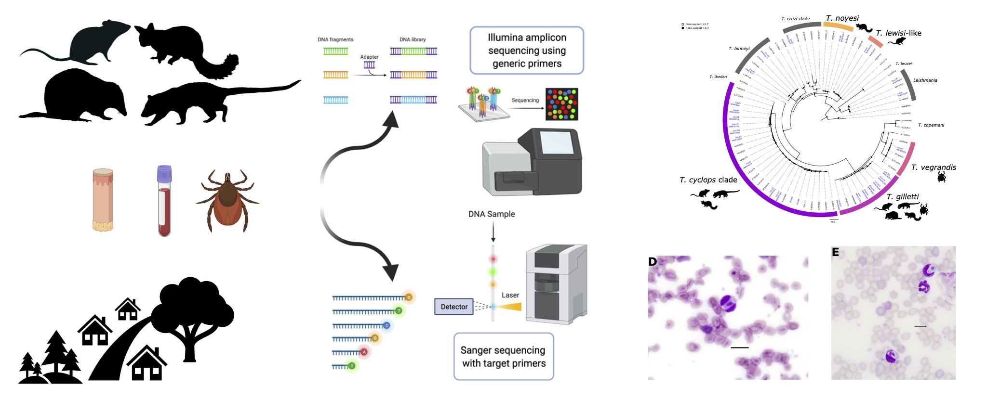
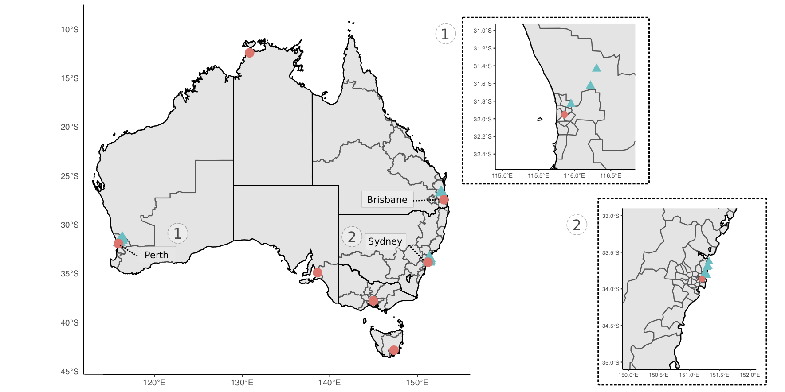
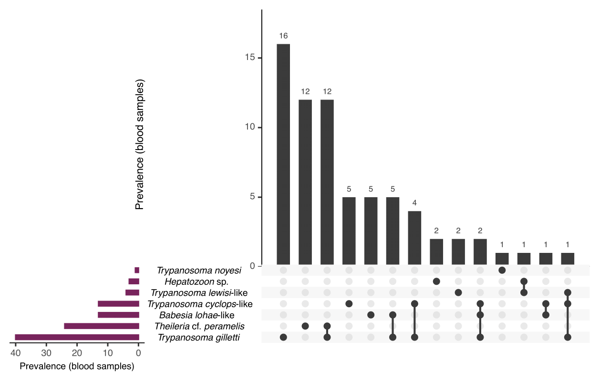
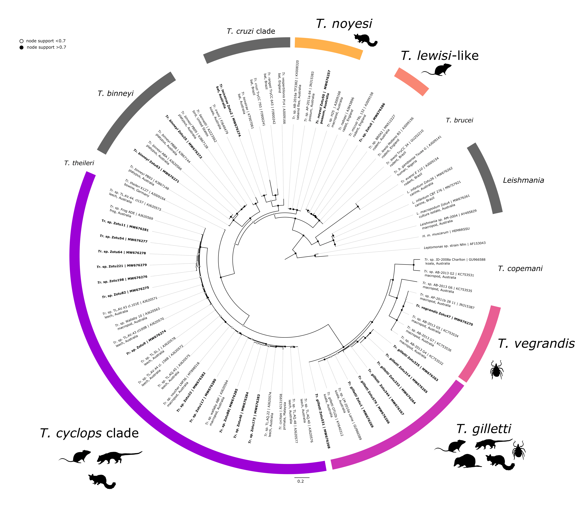
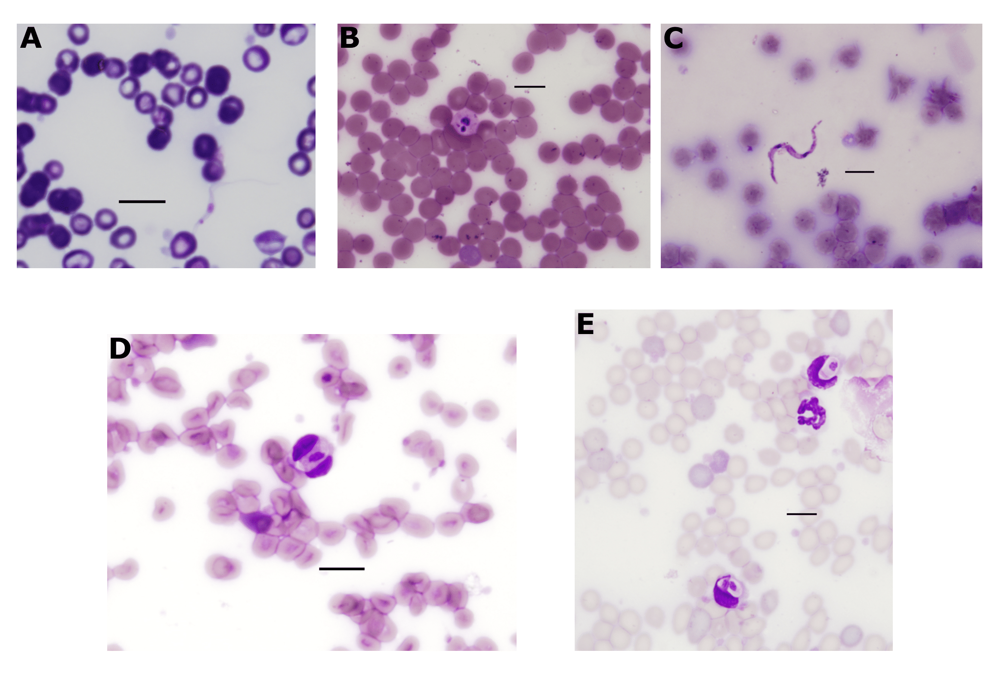
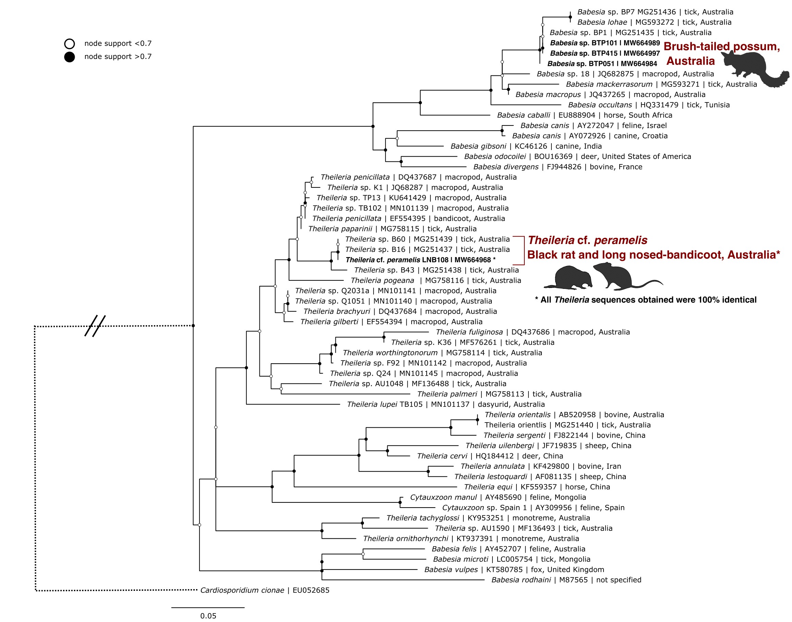
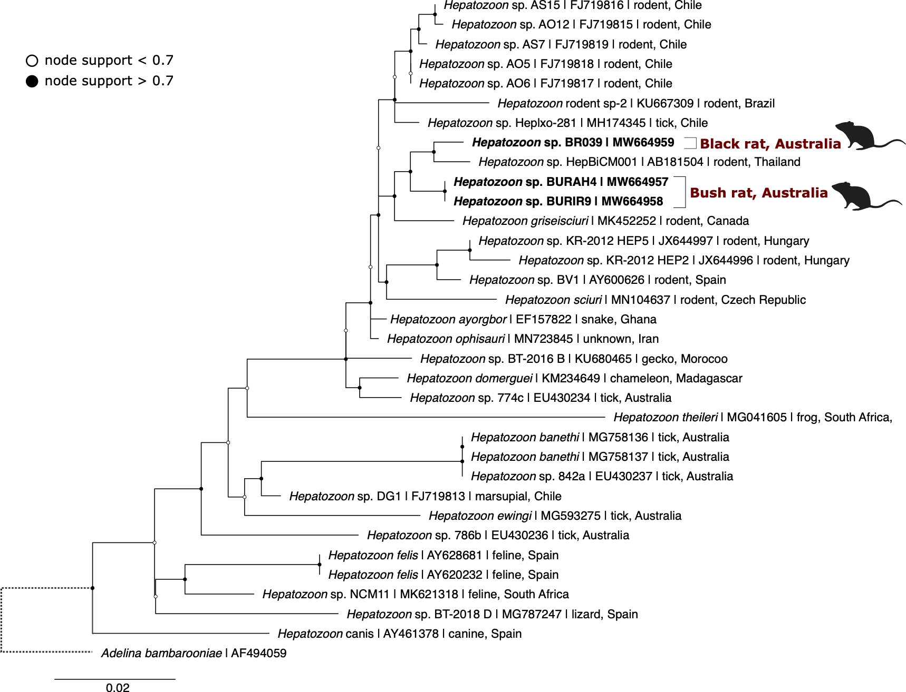

---
output:
  #bookdown::html_document2: default
  #bookdown::word_document2: default
  bookdown::pdf_document2:
    template: templates/brief_template.tex
    citation_package: biblatex
documentclass: book
#bibliography: [bibliography/bibtex.bib, bibliography/additional-references.bib]
---

# Haemoprotozoa surveillance {#wildlife-haemoprotozoa}
\chaptermark{Haemoprotozoa}

```{r F4preface, out.width='100%', out.align = 'left', echo=FALSE}

```

\newpage

## Preface {.unnumbered}

**Attribution Statement**

The following chapter has been drafted in accordance with the journal *Current Research in Parasitology and Vector-Borne Diseases*. 

The following manuscript has been published: **Egan, S.**, Taylor, C., Austen, J., Banks, P., Northover, A., Ahlstrom, L., Ryan, U., Irwin, P., and Oskam C. Haemoprotozoan surveillance in peri-urban native and introduced wildlife from Australia. *Current Research in Parasitology and Vector-Borne Diseases*, **1**, 100052. DOI: [10.1016/j.crpvbd.2021.100052](https://doi.org/10.1016/j.crpvbd.2021.100052)

The following authors contributed to this manuscript as outlined below^[Contribution indicates the total involvement the author has had in this project. Placing an ‘X’ in the remaining boxes indicates what aspect(s) of the project each author engaged in.].

```{r include=FALSE}
library(readxl)
library(tidyverse)
attrib <- read_excel("front-and-back-matter/preface/attributions-haemoprotozoa.xlsx")
```
```{r, echo=FALSE}
library(kableExtra)
knitr::kable(attrib, booktabs = TRUE, linesep = "") %>%
  kable_styling(font_size = 7.0) %>%
  kable_styling(latex_options = c("striped", "hold_position"))
```

By signing this document, the Candidate and Principal Supervisor acknowledge that the information provided is accurate and has been agreed to by all other authors. 

\vspace{3mm}

\raggedright

| __________________ &nbsp; &nbsp; &nbsp; __________________
|   Candidate &nbsp; &nbsp; &nbsp; &nbsp; &nbsp; &nbsp; &nbsp; &nbsp; &nbsp; &nbsp; &nbsp; &nbsp; &nbsp; &nbsp; &nbsp; &nbsp; Principal Supervisor

\newpage

**Chapter linking statement:** 
This chapter explore the haemoprotozoa present in samples from Australian wildlife. In particular the focus was on blood-borne protozoa; trypanosomes (*Leishmania* and *Trypanosoma*), piroplasms (*Babesia* and *Theileria*) and *Hepatozoon*. Using a combination of amplicon metabarcoding, Sanger sequencing and microscopy a total of eight species of *Babesia*, *Hepatozoon*, *Theileria* and *Trypanosoma* were identified. For this chapter the focus was on the blood samples from wildlife, however in the case of trypanosomes tissue and tick samples were also sequenced. The aim of this study was to identify what haemoprotozoa species are present in wildlife at the urban interface.

\vspace{5mm}

**Acknowledgment statement:** This work was supported by resources provided by the Pawsey Supercomputing Centre with funding from the Australian Government and the Government of Western Australia. 
We acknowledge the Department of Biodiversity, Conservation and Attractions staff for their invaluable assistance in Western Australian fieldwork, in particular Rebecca Kay, Douglas Giles and Hannah Kilian. 
We also thank Jade Kelly for assistance in fieldwork and sample collection. 
We acknowledge Drs Amanda Barbosa and Andrea Paparini, and A/Prof. Christopher Peacock, for the provision of control isolates used for validation of assays. 
We thank Drs David Chandler, Christopher Noune and Matthew Stevens at the Australian Genomics Research Facility for their assistance in sequencing.

\vspace{5mm}

**Funding statement:** This study was part-funded by the Australian Research Council (LP160100200), Bayer HealthCare (Germany) and Bayer Australia. SLE was supported by an Australian Government Research Training Program (RTP) Scholarship. CLT was supported by a scholarship from the Northern Beaches Council. This project was also part supported by The Holsworth Wildlife Research Endowment from The Ecological Society of Australia (awarded to SLE) and the Paddy Pallin Science Grant from The Royal Zoological Society (awarded to CLT).

\vspace{5mm}

**Data availability:** 

Raw Illumina MiSeq data has been deposited in the European Nucleotide Archive under project number [PRJEB46031](https://www.ebi.ac.uk/ena/browser/view/PRJEB46031) (sample accession numbers ERS6633767--ERS6634241). Nucleotide data produced has been submitted to GenBank under accession numbers MW664957--MW664997 and MW676261--MW676287. Scripts and code used for bioinformatics and statistical analysis are available on [GitHub](https://github.com/siobhon-egan/wildlife-haemoprotozoa) and [the project website](https://siobhonlegan.com/wildlife-haemoprotozoa).

\vspace{5mm}

**Animal ethics:** 
Ethical approval for this study was granted by the Murdoch University Animal Ethics Committee (permit number R3026/18), the Department of Biodiversity Conservation and Attractions (permit numbers 2018/54B, 2018/55B, 2018/57D and 2017/30), and the University of Sydney Animal Ethics Committee (permit number 2018/1429).

\vspace{5mm}

**Author contributions::**
Conceptualisation: S.L.E., U.M.R., P.J.I., C.L.O.
Data curation: S.L.E., C.L.T.
Formal Analysis: S.L.E.
Funding acquisition: S.L.E., C.L.T., P.B.B., L.A.A., U.M.R., P.J.I., C.L.O.
Investigation: S.L.E., C.L.T., J.M.A.,
Methodology: S.L.E., C.L.T., J.M.A., A.S.N.
Project administration: P.J.I., C.L.O.
Resources: A.S.N., P.B.B., P.J.I., C.L.O.
Software: S.L.E.
Supervision: P.B.B., U.M.R., P.J.I., C.L.O.
Visualisation: S.L.E.
Writing – original draft: S.L.E.
Writing – review & editing: S.L.E, C.L.T., P.B.B., A.S.N., L.A.A., U.M.R., P.J.I., C.L.O.

\vspace{5mm}

**Keywords:** Haemoprotozoa, Wildlife, Marsupial, *Trypanosoma*, *Babesia*, *Hepatozoon*, *Theileria*

\newpage


## Abstract

Vector-borne haemoprotozoans comprise a diverse group of eukaryote single-celled organisms transmitted by haematophagous (blood-feeding) invertebrates. 
They can cause debilitating diseases that impact wildlife, livestock, companion animals and humans. 
Recent research has shown that Australian wildlife host a diverse range of haemoprotozoan species; however, to date this work has primarily been confined to a few host species or isolated populations in rural habitats. 
There has been little investigation into the presence of these blood parasites in wildlife inhabiting urban and peri-urban areas. 
In this study, blood and tissue samples and ticks were collected from wildlife in New South Wales and Western Australia. 
Extracted DNA samples were screened with pan-specific molecular assays to determine the presence of haemoprotozoans using amplicon metabarcoding and Sanger sequencing approaches. In addition, light microscopy was performed on blood films. 
Eight haemoprotozoans were identified in the present study, which included species of *Babesia*, *Hepatozoon*, *Theileria* and *Trypanosoma.* Blood samples were collected from 134 animals; 70 black rats (*Rattus* *rattus*), 18 common brush-tailed possums (*Trichosurus* vulpecula), two bush rats (*Rattus fuscipes*), 22 chuditch (*Dasyurus geoffroii*), 20 long-nosed bandicoots (*Perameles nasuta*), one quenda (*Isoodon fusciventer*) and one swamp rat (*Rattus lutreolus*). 
Molecular screening of DNA extracted from blood samples identified 52.2% (95% CI: 43.8--60.5%) of individuals were positive for at least one haemoprotozoan species, with 19.4% (95% CI: 13.4--26.7%) positive for more than one species. 
The present study provides the first sequences of *Theileria* cf. *peramelis* from black rats and long-nosed bandicoots. 
*Babesia lohae* was identified from brush-tailed possums. 
Two *Hepatozoon* genotypes were identified from black rats and bush rats. Black rats showed the highest haemoprotozoan diversity, with five species identified. 
No known human pathogens that have been described in the northern hemisphere were identified in the present study, and future work is required to understand the zoonotic potential of these microbes in Australia. 
This work represents the first large-scale body of research using molecular tools to investigate haemoprotozoans in animals at the urban-wildland interface. 
Further research is needed to investigate potential consequences of infection in wildlife, particularly effects of pathogen spillover from invasive black rats to native wildlife.

## Introduction

Urbanisation is increasing globally with far reaching effects outside the city boundaries, leading to biodiversity loss and changes in species interactions [@bradleyUrbanizationEcologyWildlife2007]. 
Some wildlife can successfully persist in these urban environments [@banksEcologicalImpactsCommensal2015;@hillmanUrbanEnvironmentsAlter2017;@rothenburgerEnvironmentalFactorsZoonotic2017]. 
The increased interaction between wildlife, people and domestic animals can result in a higher risk of potential spillover events where pathogens jump from wildlife to humans [@hosseiniDoesImpactBiodiversity2017]. 
The influences of human disturbance in these urban areas can have complex flow-on effects that impact ecosystem health. 
Anthropogenic effects such as food sources, shelter and habitat fragmentation can alter wildlife abundance, behaviour and interactions, which may result in a heightened risk of infection and disease transmission [@daszakEmergingInfectiousDiseases2000;@bradleyUrbanizationEcologyWildlife2007]. 

Haemoprotozoans are blood-borne unicellular eukaryotes that are capable of infecting all terrestrial vertebrate groups [@mcadamInfectiousDiseasesChapter2010]. 
A diverse range of vectors have been implicated in the life-cycle of haemoprotozoans, including flies (Diptera), ticks (Ixodida), assassin bugs (Reduviidae) and leeches (Hirudinea) [@odonoghueHaemoprotozoaMakingBiological2017]. 
Globally there are numerous species of veterinary and medical importance, many of which naturally circulate through domestic animals or urban wildlife and may pose a zoonotic risk.
Human and animal diseases from haemoprotozoan infections can include trypanosomiasis (*Trypanosoma*), babesiosis (*Babesia*), leishmaniasis (*Leishmania*) and theileriosis (*Theileria*) [@schreegMitochondrialGenomeSequences2016;@kostygovEuglenozoaTaxonomyDiversity2021]. 
Human infection with haemoprotozoans is a consequence of zoonotic spillover events, where pathogens jump from animals to humans.
In the case of *Babesia*, wildlife such as deer and small rodents have been described as an important part of the enzootic cycles in parts of Europe [@silaghiAnaplasmaPhagocytophilumBabesia2020;@fanelliHistoricalReviewBabesia2021] and the USA [@yabsleyNaturalHistoryZoonotic2013;@azagiCirculationBabesiaSpecies2021].
Changes in land use and encroachment of areas where wildlife inhabit are the main drivers of these spillover events [@diuk-wasserImpactLandUse2020;@plowrightLandUseinducedSpillover2021].
Therefore, surveillance of microbes circulating in wildlife at this urban-wildland interface is critical to untangle zoonotic disease risk.

In recent years there have been increasing reports of tick-associated illnesses in Australians [@chaladaThereLymelikeDisease2016]. 
A single case of babesiosis, caused by *Babesia microti*, from an Australian patient with no recent travel history has also been reported [@senanayakeFirstReportHuman2012;@papariniMolecularConfirmationFirst2014]. 
An epidemiological investigation, including screening of relatives and pets, did not identify any additional cases. 
Since then, a large-scale screening of blood donor samples (*n* = 7,000) further supported the absence of widespread *Babesia microti* in Australia [@faddyNoEvidenceWidespread2019]. 
As a result, the origin of the infection remains unknown. However, one hypothesis of its origin is that a local tick may have been responsible for an autochthonous infection, presumably from introduced rodent(s) [@senanayakeFirstReportHuman2012].

Pioneered by Mackerras, microscopic insights revealed that Australia's unique wildlife are hosting an equally diverse collection of haemoprotozoans [@mackerrasHaematozoaAustralianMammals1959;@mackerrasHaematozoaAustralianBirds1960;@mackerrasHaematozoaAustralianReptiles1961]. 
The advent of molecular tools has helped to provide further insight into the taxonomy and diversity of blood-borne protozoans from Australian wildlife [@adlardPerspectivesBiodiversityParasitic1998;@sprattWildlifeParasitologyAustralia2019].
Several novel haemoprotozoans have been described recently, including *Leishmania* and *Babesia* from kangaroos [@roseCutaneousLeishmaniasisRed2004;@dawoodObservationNovelBabesia2013], *Trypanosoma* from koalas, potoroos and quokkas [@austenMorphologicalMolecularCharacterization2009;@mcinnesPotentialImpactNative2011] and *Theileria* from bettongs and potoroos [@leeTheileriaGilbertiSp2009;@northoverIncreasedTrypanosomaSpp2019]. 
However to date, most of this research in Australia has been 'vertebrate host-centric', and there have been few holistic studies on wildlife haemoprotozoans at the urban-wildland interface.
Furthermore, very few studies have incorporated eutherian hosts despite this clade accounting for about half of the mammal species extant in Australia [@flemingGoodBadUgly2016]. 
As a result, relatively little data has been collected on eutherian haemoprotozoans in recent decades compared to marsupials (metatherians) and monotremes.
It is possible that such endemic haemoprotozoans could be involved in spillover event(s); thus, from a public health perspective, it is essential to collect baseline data on the health and parasite communities of all Australian wildlife, particularly in urban and peri-urban areas. 
In addition, further surveillance may also shed light on the status of *Babesia microti* in Australia, given the events described above.

This study aimed to document three haemoprotozoan groups (i) trypanosomes (*Leishmania* spp. and *Trypanosoma* spp.), (ii) piroplasms (*Babesia* spp. and *Theileria* spp.) and (iii) *Hepatozoon* spp., from Australian wildlife in urban and peri-urban areas. 
Using amplicon metabarcoding and Sanger sequencing, a semi-targeted approach was used with assays targeting conserved regions of the 18S rRNA gene. 
The focus of this study was to screen wildlife blood and tissue biopsy samples and their ticks for haemoprotozoans.

## Methods

### Sample collection and microscopy

**Small mammal trapping**

Small mammal trapping was performed at sites in Perth, Western Australia and Sydney, New South Wales (Figure \@ref(fig:Ch4map)). 
Sites were targeted in urban and peri-urban areas to reflect the human-wildland interface.
Elliot and cage traps were set and baited with universal bait (rolled oats, peanut butter and sardines). 
Traps were set at dusk and cleared at sunrise over three or four consecutive nights. 
To ensure a comprehensive assessment and sampling, target mammals were briefly anaesthetised in the field using isoflurane vaporised in medical oxygen (1 litre/minute). 
Animals were weighed and examined systematically for ectoparasites. 
Up to 1 mL of blood was collected from either the caudal (tail) vein, femoral vein or ear capillary and stored in Mini Collect EDTA tubes. 
If practical, a 2 mm punch biopsy was taken at the tick bite site; where possible, a biopsy was taken from the ear and stored in RNAlater or 80% ethanol. 
Animals were systematically examined for ectoparasites which were removed and stored in 80% ethanol. 
Recovery from anaesthesia was achieved by providing medical oxygen, and once fully alert, animals were released at trap point. 
An individual mark was applied to identify animals using either a microchip administered sub-cutaneously or a unique patch of hair was removed. 

**Opportunistic collection**

In a small number of cases, animal carcasses were also obtained opportunistically (*n* = 10). 
These specimens were collected through incidental findings during fieldwork or from situations where animals were humanely euthanised in accordance with animal ethics and state and federal guidelines.
In the case of carcasses spleen samples were collected in replacement for blood samples, this
128 occurred for the following hosts; black rat (*n* = 2), long-nosed bandicoot (*n* = 1) and rabbit (*n* = 7).

**Tick identification**

Ticks were collected and stored in tubes containing 70--90% ethanol. Samples were visualised using an Olympus SZ61 stereomicroscope (Olympus, Centre Valley, PA, USA) with an external Schott KL 1500 LED (Schott AG Mainz, Germany) light source. Photographs of tick specimens were taken using an Olympus SC30 digital camera (Olympus, Centre Valley, PA, USA) and analysis getIT software (Olympus, Centre Valley, PA, USA). 
Instar, sex and species were identified using a combination of available morphological keys and species descriptions [@robertsAustralianTicks1970;@jacksonMorphologicalComparisonAdult2002;@laanObservationsBiologyDistribution2011;@barkerTicksAustraliaSpecies2014;@kwakPhylogeneticAnalysisAustralian2017].

```{r Ch4map, out.width='95%', out.align = 'left',fig.scap = "Map of study sites for wildlife samples.", fig.cap = "Map of study sites for collection of wildlife sample used in haemoprotozoan surveillance (denoted by blue; capital cities denoted for reference). Insert maps of sites in (1) Perth, Western Australia and (2) Sydney, New South Wales.", echo=FALSE}

```

**Haemoparasite microscopy**

Thin blood smears were made from whole blood, allowed to air dry and then fixed with 100% methanol. 
Slides were stained with Diff Quick (Siemens, Germany) and a coverslip was mounted using DPX neutral mounting medium (LabChem, Australia). 
The smears were inspected by light microscopy (Olympus BX51) for the presence of haemoprotozoans at magnifications of ×400 and under oil immersion at ×1000.

### DNA extractions

Total genomic DNA (gDNA) was extracted from 200 $\mu$L of blood using a MasterPure DNA purification kit (Epicentre\textregistered Biotechnologies, Madison, Wisconsin, U.S.A) following the manufacturer's recommendations. 
Where 200 $\mu$L of blood was not available, sterile DNA free phosphate-buffered saline (PBS) was used to make samples up to 200 $\mu$L. Genomic DNA was eluted in 30--40 $\mu$L of TE buffer and stored at -20$^\circ$C until further processing.

Tissue samples (skin and spleen) were first rinsed in sterile, DNA-free PBS and cut into small pieces using a sterile scalpel blade. Samples were homogenised in 180 $\mu$L of buffer ATL and 20 $\mu$L of proteinase K was added prior to incubation at 56$^\circ$C for ~ 16 hours. gDNA was extracted using the QIAamp DNA Mini Kit (QIAGEN, Germany) following the manufacturer's protocols and final elution volume was decreased to 40--50 $\mu$L to optimise gDNA yield.

Once ticks were identified they were surface-sterilised by washing in 10 % hypochlorite solution, rinsed in 70 % ethanol and DNA-free PBS, and then air-dried. 
Genomic DNA was extracted using the DNeasy Blood and Tissue kit (QIAGEN, Germany) for adults or the QIAamp DNA Mini Kit (QIAGEN, Germany) for nymphs and larvae. 
Due to the large number of larvae collected from some animals and the expected low DNA yield, in some cases up to 5 larvae were pooled based on host, species and engorgement status. 
Ticks were placed in a 2 mL safe lock Eppendorf tube with a 5 mm steel bead, frozen in liquid nitrogen for 1 min and homogenised by shaking at 40 Hz in a Tissue Lyser LT (QIAGEN, Germany). 
Final elution of DNA was adjusted according to tick size, between 30-150 $\mu$L of AE buffer was added to the silicon membrane.

Extraction blank controls (EXBs) consisting of 200 $\mu$L sterile DNA free PBS, were included randomly in each extraction batch. Blood and tissue samples were extracted in a separate laboratory, away from where ticks were processed to avoid cross-contamination between sample types. Sterile procedures were followed throughout the laboratory process.

### Trypanosomes

**Validation**

Positive controls of *Leishmania infantum* (bone marrow sample obtained from a domestic dog), *Leishmania macropodum* (culture isolate), *Trypanosoma binneyi* (blood sample obtained from a platypus, *Ornithorhynchus anatinus*), *Trypanosoma cyclops*-like (blood sample obtained from a Tasmanian devil, *Sarcophilus harrisii*) and  *Trypanosoma teixeirae* (blood sample obtained from a flying fox, *Pteropus scapulatus*) were used for assay validation.

**Sequencing and bioinformatics**

A high-throughput metabarcoding approach was used to sequence samples (blood, ticks and tissue) using the Illumina MiSeq platform. Sample libraries were built following the 16S Metagenomic Sequencing Library Preparation (Illumina Part \# 15044223 Rev. B), with amplicon PCR primers containing an Illumina MiSeq adapter sequences (Table \@ref(tab:T4primers)).

Kinetoplastid libraries were built targeting the *18S rRNA* hypervariable region v7-8. Samples were amplified using a semi-nested PCR with primary primers S825F and TryAllR1 [@maslovPhylogenyTrypanosomesInferred1996;@barbosaIncreasedGeneticDiversity2017] and the secondary primers S825F and 662R [@maslovPhylogenyTrypanosomesInferred1996] containing MiSeq sequence adapters. 
Reactions were carried out in 25 $\mu$L volumes each containing: 1X buffer (KAPA Biosystems, South Africa), 2.0 mM MgCl~2~, 0.4 mg/ml of bovine serum albumin (Fisher Biotech), 0.4 $\mu$M of each primer, 0.25 mM of each dNTP, 0.5 U of Taq (KAPA Biosystems, South Africa) and 2$\mu$L of gDNA or 1 $\mu$L of primary PCR product. 
Thermal cycling conditions were as follows; 95$^\circ$C for 3 mins, followed by 40 cycles of 95$^\circ$C for 30 secs, 53$^\circ$C (primary) or 55$^\circ$C (secondary) for 30 secs, 72$^\circ$C for 30 secs; and a final extension step of 72$^\circ$C for 5 mins.

Amplicon PCR products were then indexed using the Nextera XT DNA library preparation kit in 25 $\mu$L volumes following the manufacturer's recommendations. 
All PCRs included no template controls (NTC) during each reaction set up and PCRs were performed under strict laboratory conditions. 
Amplicons were then dual-indexed using the Nextera XT index kit. 
Reactions were performed in 25 $\mu$L volumes following the manufacturer's recommendations. 
Libraries were purified with Axygen PCR clean up beads and quantified using Qubit High Sensitivity dsDNA assay kit (Thermo Fisher Scientific, Waltham, MA, USA). 
Concentration of trypanosome libraries was highly variable among samples. 
To ensure samples were analysed uniformly, all libraries were included for sequencing regardless of apparent negative result after PCR (as indicated by gel electrophoresis or Qubit concentration).
This decision was made to ensure that even low levels of haemoprotozoans would be detected.
Libraries were shipped to the Australian Genomic Research Facility (Melbourne, Australia) for final QC and sequenced on an Illumina MiSeq using v2 chemistry (2 x 250 paired-end).

Trypanosome MiSeq data was analysed using a bioinformatic pipeline with the program USEARCH v11 [@edgarSearchClusteringOrders2010]. 
Briefly paired-end reads were merged and sequences matching forward and reverse primers were retrieved (max number of mismatches = 2). 
Sequences were then quality-filtered and singletons were removed.
The unoise3 [@edgarUNOISE2ImprovedErrorcorrection2016] algorithm was used to perform denoising (error-correction) and generate zero-radius taxonomic units (zOTUs). 

(ref:primersT41) List of primers used for the amplification of haemoprotozoans from Australian wildlife samples. References **1.** Maslov et al. [-@maslovPhylogenyTrypanosomesInferred1996], **2.** Barbosa et al. [-@barbosaIncreasedGeneticDiversity2017], **3.** Jefferies et al. [-@jefferiesPCRRFLPDetectionDifferentiation2007].

```{r include=FALSE}
library(readxl)
library(tidyverse)
Ch4_primers <- read_excel("tables/Ch4-primers.xlsx",
    col_types = c("skip", "text", "text",
        "text", "skip", "skip"))
# Ch4_primers %>%
#   mutate_all(~ replace_na(.x, ""))
```

```{r T4primers, echo=FALSE, message=FALSE, warning=FALSE}
library(kableExtra)
opts <- options(knitr.kable.NA = "")
knitr::kable(Ch4_primers, booktabs = TRUE, linesep = "", caption = "(ref:primersT41)",
  caption.short = "Primers used for haemoprotozoa detection in samples from ticks and wildlife.") %>%
  kable_styling(font_size = 8.5) %>%
  row_spec(c(1, 5),  bold = T)
```

### Piroplasm and *Hepatozoon*

Blood samples were screened for piroplasms using a nested PCR targeting an ~ 800 bp product of the 18S rRNA gene  (Table \@ref(tab:T4primers)) [@jefferiesPCRRFLPDetectionDifferentiation2007]. 
Amplicon PCRs were carried out in 25 $\mu$L reactions each containing: 1X buffer (KAPA Biosystems, South Africa), 2.5 mM MgCl~2~, 0.4 $\mu$M of each primer, 0.25 mM of each dNTP, 0.5 U of Taq (KAPA Biosystems, South Africa) and 2 $\mu$L of gDNA or 1 $\mu$L of primary product. 
Thermal cycling conditions were as follows; 95$^\circ$C for 2 mins, 58$^\circ$C for 1 min, 72$^\circ$C for 2 mins, followed by 40 cycles of 95$^\circ$C for 30 secs, 58$^\circ$C (primary) or 62$^\circ$C (secondary) for 20 secs, 72$^\circ$C for 1 min (primary) or 45 secs (secondary); and a final extension step of 72$^\circ$C for 5 mins.

Amplicons were visualised on agarose gel and products of the expected size were excised with a sterile scalpel blade and purified [@yangSpecificQuantitativeDetection2013]. 
Sanger sequencing was performed at the Australian Genome Research Facility (Perth, Western Australia) on an Applied Biosystems 3730XL DNA Analyzer using BigDye^TM^ Terminator v3.1 Cycle Sequencing Kit.
Nucleotide sequences were inspected and quality-filtered using Geneious 10.2.6 (https://www.geneious.com). 

### Sequence identification and phylogenetics

Nucleotide sequences were subject to BLAST analysis (BLASTN 2.11.0+ [@zhangGreedyAlgorithmAligning2000; @morgulisDatabaseIndexingProduction2008]) against NCBI nucleotide collection (nt) database. 
Taxonomic lineage for each top hit (based on e-value score) was retrieved from NCBI taxonomy database using TaxonKit [@weissHostReproductiveCycle2021]. 
Final taxonomy assignment was then refined to the lowest common ancestor based on BLAST results (percentage identity, e-value and query coverage) and sequence alignment method. 
For trypanosome metabarcoding positive and negative controls were inspected, a read cut-off threshold was set with sequence values <150 removed.
Generated sequences were then aligned with reference sequences retrieved from GenBank [@bensonGenBank2017] using MUSCLE [@edgarMUSCLEMultipleSequence2004]. 
Phylogenies were inferred using the maximum likelihood (ML) method. 
The optimal evolutionary model was selected using ModelFinder [@kalyaanamoorthyModelFinderFastModel2017] based on Bayesian information criterion. 
Phylogenetic analysis was performed in IQ-TREE v1.6.11 [@nguyenIQTREEFastEffective2015] and bootstrap support was calculated using the ultrafast (UFBoot2) method with 10,000 replicates [@hoangUFBoot2ImprovingUltrafast2018]. 
Genetic sequence similarity was calculated using the Kimura 2-Parameter method [@tamuraEstimationNumberNucleotide1993].

Scripts for data analysis are available at https://github.com/siobhon-egan/wildlife-haemoprotozoa.
Raw Illumina MiSeq data has been deposited in the European Nucleotide Archive under project accession number PRJEB46031 (sample accession numbers ERS6633767--ERS6634241) and nucleotide data has been deposited in GenBank nucleotide database under accession numbers MW664957--MW664997, and MW676261--MW676287.

### Prevalence

Confidence intervals for haemoprotozoan prevalence were calculated based on positive identification from blood samples only.
This is due to the inherent difficulties in calculating prevalence based on blood-fed ticks [@estrada-penaPitfallsTickTickBorne2021].
Additionally, the focus of the present study was the identification of haemoprotozoa from a wildlife host perspective.
Confidence intervals (95% CIs) were calculated based on the Jeffreys interval [@brownIntervalEstimationBinomial2001].


## Results

### Sample information

Blood samples were collected from 134 individuals: 70 black rats (*Rattus rattus*), 18 common brush-tailed possums (*Trichosurus vulpecula*), two bush rats (*Rattus fuscipes*), 22 chuditch (*Dasyurus geoffroii*), 20 long-nosed bandicoots (*Perameles nasuta*), one quenda (*Isoodon fusciventer*, previously *Isoodon obesulus fusciventer*), and one swamp rat (*Rattus lutreolus*). 
A total of 52.2% (95% CI: 43.8--60.5%) of animals were positive for at least one haemoprotozoan, with 19.4% (95% CI: 13.4--26.7%) of animals positive for more than one species (Figure \@ref(fig:Ch4upset)).

A total of 205 tick DNA pools which consisted of 257 ticks were extracted. 
A total of six tick species were identified, the following numbers refer to DNA extracts analysed and total number of specimens for each species respectively: *Amblyomma triguttatum* (4/5), *Ixodes antechini* (1/1), *Ixodes australiensis* (1/1), *Ixodes holocyclus* (67/81), *Ixodes tasmani* (90/103) and *Ixodes trichosuri* (37/48). An additional 5 DNA pools which included 18 specimens were identified as a mix of *Ix. holocyclus* and *Ix. trichousri*.

```{r Ch4upset, out.width='95%', out.align = 'left',fig.scap = "Summary of haemoprotozoa prevalence in wildlife blood samples.", fig.cap = "Prevalence of haemoprotozoans identified from wildlife blood samples presented as number infected of individuals. Data are visualised using UpSet plot showing set intersections of \\textit{Trypanosoma}, \\textit{Theileria}, \\textit{Babesia} and \\textit{Hepatozoon} species identified. Total number of individuals sampled: \\textit{n} = 134.", echo=FALSE}

```

### Trypanosomes

**Bioinformatic results**

A total of 51,719,606 raw sequences were obtained from Illumina MiSeq, with 24,138,102 sequences after merging, 22,716,805 sequences after matching primers and then 12,047,863 sequences post-quality filtering (representing ~23.3% of raw sequences). 
After denoising, 10,283,530 sequences were obtained from samples; 1,355,654 sequences from positive controls and 305,910 negative controls (Figure \@ref(fig:FA41)). 
The average length of sequences post-filtering was 298 bp for positive controls (see validation) and 271 bp for samples. 
Denoising via the unoise3 algorithm produced 1,630 zOTUs (avg length 233 bp). Taxonomic assignment showed 607 zOTUs were assigned to Eukaryota, with 346 zOTUs belonging to Kinetoplastea (Phylum: Euglenozoa) and 129 zOTUs identified as family Trypanosomatidae. 
A final 65 Trypanosomatidae zOTUs remained after removing low abundant sequences (i.e. < 150 sequences) with a total of 6,959,707 sequences (samples = 5,811,323; positive controls = 1,148,384) (see [Supplementary Table E2.1](#supplementary-table-e2.1) for sequence data and taxonomy including BLAST results).
For phylogenetic reconstruction, a representative subset of 27 zOTUs were used (Figure \@ref(fig:Ch4tryptree)); of which 22 zOTUs were from samples and an additional five zOTUs that were generated from positive control samples.


**Validation**

All positive controls of *L. infantum*, *L. macropodum*, *Tr. binneyi*, *Tr. cyclops*-like and *Tr. teixeirae* were successfully amplified, confirming the ability of this assay to detect a phylogenetically diverse range of trypanosome sequences ([Supplementary Table E2.1](#supplementary-table-e2.1)). The resulting zOTUs were included in phylogenetic reconstruction (Figure \@ref(fig:Ch4tryptree)).

**Samples**

Amplicon sequencing results from blood samples showed that 51 animals were positive for at least one species of *Trypanosoma*. 
Mixed trypanosome infections were identified in 5.2% (95% CI: 2.4--10.0%) of blood samples from 4.3% (95% CI: 1.2--11.0%) of black rats, 16.7% (95% CI: 4.9--38.1%) of brush-tailed possums, and a single chuditch (4.6%, 95% CI: 0.5--19.3%). 
One black rat (1.4%, 95% CI: 0.2--6.9%) was infected with three species of *Trypanosoma*. 

*Trypanosoma gilletti* was the most abundant trypanosome species identified. 
A total number of 69 zOTUs had a top match to *Tr. gilletti*, eleven zOTUs had greater than 1000 reads, of which seven zOTUs were used for phylogenetic purposes in Figure \@ref(fig:Ch4tryptree). 
This was the only species of *Trypanosoma* identified in all three sample types (blood, ticks and tissue).
A total of 103 samples were positive (43 blood samples, 23 tick samples and 37 tissue samples); these samples were identified from 65 individuals.
Hosts identified as positive in blood and/or tissue samples for *Tr. gilletti* were black rats (*n* = 14), brush-tailed possums (*n* = 12), chuditch (*n* = 7) and long-nosed bandicoots (*n* = 28).
Ticks positive for *Tr. gilletti* were *Ix. holocyclus* (larvae, nymphs and females), *Ix. tasmani* (females) and *Ix. trichosuri* (nymphs and females).
A thin trypomastigote stage was identified in the blood film of a long-nosed bandicoot (LNB113) (Figure \@ref(fig:microscopy)A). 
Amplicon metabarcoding of duplicate blood DNA extracts from this individual showed a single infection with *Tr. gilletti*.

Fourteen zOTUs were most similar to members of the *Trypanosoma cyclops* clade, matching sequences from Australian marsupials and leeches (GenBank: AJ620571, AJ620574, MT898517 and MT898518; 97.5--99.7% similarity). 
Representatives of the 12 most abundant zOTUs were used for the phylogenetic tree in Figure \@ref(fig:Ch4tryptree). 
*Trypanosoma cyclops*-like sequences were identified in 13 blood samples from 13 individuals (7 black rats, 5 brush-tailed possums and 1 chuditch were positive). 
Only one tissue sample, from a brush-tailed possum (blood sample negative), was positive and all ticks were negative for *Tr. cyclops*-like sequences.
Unfortunately, morphological verification of this trypanosome was difficult. 
A potential amastigote stage of *Tr. cyclops* was identified in a black rat (BR022) (Figure \@ref(fig:microscopy)B) and a trypomastigote like stage from a second black rat (BR025) (Figure \@ref(fig:microscopy)C), amplicon metabarcoding of both these animals identified a single trypanosome infection with *Tr. cyclops*.

One sequence (zOTU 5) was identical to *Trypanosoma* sp. BR042 (MN512227, 100% similarity), which was characterised in Egan et al. [-@eganMolecularIdentificationTrypanosoma2020] to explore the phylogeny of this *Tr. lewisi*-like sequence. 
This genotype was identified in three black rats and a single bush rat from two sites, North Head and Manly Dam in New South Wales. 
Two black rats (sample IDs BR042 and BRAH1) were positive for *Tr. lewisi*-like sequences in both tissue and blood samples. 
No tick samples were positive for *Tr. lewisi*-like sequences.
*Trypanosoma noyesi* was identified in a single brush-tailed possum blood sample from Western Australia. 
*Trypanosoma vegrandis* (zOTU 47; GenBank: KC753534, 100% similarity) was identified in an *Am. triguttatum* (nymph) (ex quenda) from Western Australia. 

```{r Ch4tryptree, out.width='95%', out.align = 'left',fig.scap = "Phylogeny of trypanosomes species from wildlife.", fig.cap = "Maximum likelihood (ML) phylogenetic reconstruction of trypanosome zOTUs based on a 426 bp alignment of the 18S rRNA gene. Substitution model TIM3e + I + G4 with 10,000 replicates. Node values correspond to bootstrap support where values > 0.7 are indicated by filled circles. Number of substitutions per nucleotide position is represented by the scale-bar. Sequences generated in the present study are in bold.", echo=FALSE}

```

```{r microscopy, out.width='95%', out.align = 'left',fig.scap = "Haemoprotozoans identified in wildlife blood films.", fig.cap = "Haemoprotozoa identified in wildlife blood films. (A) Trypomastigote of \\textit{Trypanosoma gilletti} from long-nosed bandicoot (LNB113). (B) Suspected amastigote of \\textit{Trypanosoma cyclops} from black rat (BR022). (C) Trypomastigote of \\textit{Trypanosoma cyclops} from black rat (BR025). (D-E) \\textit{Hepatozoon} gametocytes within leukocytes of a black rat (BR039). All scale-bars: 10 $\\mu$M.", echo=FALSE}

```

### Piroplasms

*Theileria* was identified in blood samples from 12.9% (95% CI: 6.6–22.2%) of black rats and 75.0% (95% CI: 53.6–89.8%) of long-nosed bandicoots from New South Wales.
All the sequences were 100% identical to each other, and therefore one representative was used for phylogenetic analysis (Figure \@ref(fig:F4pirotree)). 
Sequences in the present study were identical to *Theileria* sp. B16 and B60 (GenBank: MG251437 and MG251439) from *Ix. tasmani* ticks ex. eastern barred bandicoot (*Perameles gunnii*, Tasmania) and long-nosed bandicoot (Queensland), respectively. 
The most similar named species was *Theileria penicillata* (GenBank: EF554395; 97.4%) from the long-nosed potoroo (*Potorous tridactylus*) [@leeTheileriaGilbertiSp2009]. 
Phylogenetic reconstruction showed that the sequences in the present study formed a unique clade with those by Loh et al. [-@lohMolecularSurveillancePiroplasms2018] (Figure \@ref(fig:F4pirotree)) and demonstrated a divergence of 2.6% to the nearest named species (see genetic distances in [Supplementary Table E2.2](#supplementary-table-e2.2)).

All *Babesia* sequences were obtained from 72.2% (95% CI: 49.4–88.5%) of brush-tailed possum blood samples in New South Wales. Three genotypes were identified with 99.7--99.9% similarity to each other (Figure \@ref(fig:F4pirotree)). 
The most similar sequence to those obtained in the present study was *Babesia* sp. BP1 obtained from *Ix. tasmani* (GenBank: MG251435, 99.7--100% similar) ex. brush-tailed possum (NSW) [@lohMolecularSurveillancePiroplasms2018]. 
The next most similar was *Babesia lohae* sequences identified from *Ix. tasmani* ex brush-tailed possum (GenBank: MG251436, 98.3--98.6% similar) [@lohMolecularSurveillancePiroplasms2018] and *Ix. holocyclus* ex. domestic cat (GenBank: MG593272, 98.2--98.5% similar) [@greayEndemicExoticNovel2018] (see genetic distances in [Supplementary Table E2.2](#supplementary-table-e2.2)).

```{r F4pirotree, out.width='95%', out.align = 'left',fig.scap = "Phylogeny of piroplasm species.", fig.cap = "Maximum likelihood (ML) phylogenetic reconstruction of piroplasm species based on an 852 bp alignment of the 18S rRNA gene. Substitution model TIM3 + F + I + G4 with 10,000 replicates. Node values correspond to bootstrap support where values > 0.7 are indicated by filled circles. Number of substitutions per nucleotide position is represented by the scale-bar. Sequences generated in the present study are in bold.", echo=FALSE}

```

### Hepatozoon 

*Hepatozoon* sequences were identified in three blood samples, two from bush rats and one from a black rat. 
The two sequences from bush rats were 100% identical to each other and the single sequence from a black rat was 98.8% similar to the bush rat genotype (Figure \@ref(fig:F4hepattree)).
The black rat genotype was most similar to *Hepatozoon* sp. HepBiCM001 (GenBank: AB181504, 99.0% similar) from a greater bandicoot rat (*Bandicota indica*) in Thailand (Dantrakool et al. unpublished), the next most similar were sequences from the bush rat, followed by *Hepatozoon ayorgbor* (GenBank: EF157822, 98.63% similar) from a ball python (*Python regius*) in Ghana [@slobodaNEWSPECIESHEPATOZOON2007] (see genetic distances in [Supplementary Table E2.3](#supplementary-table-e2.3)). 
The bush rat genotype was most similar to sequences from olive grass mice (*Abrothrix olivaceus*) in Chile [@merinoMolecularCharacterizationAncient2009], genotypes *Hepatozoon* sp. AO5 and A06 (GenBank: FJ719818 and FJ719817; both 98.8% similar). 
The next most similar sequence to the bush rat genotype was *Hepatozoon ophisauri* (host unknown) from Iran (Zechmeisterova, unpublished) (GenBank: MN723845, 98.8% similar).
Microscopy of blood films from positive individuals identified oval shaped *Hepatozoon* gametocytes within leukocytes (Figure \@ref(fig:microscopy)D-E). 

```{r F4hepattree, out.width='95%', out.align = 'left',fig.scap = "Phylogeny of \\textit{Hepatozoon} species.", fig.cap = "Maximum likelihood (ML) phylogenetic reconstruction of \\textit{Hepatozoon} based on an 829 bp alignment of the 18S rRNA gene. Substitution model HKY + F + I + G4 with 10,000 replicates. Node values correspond to bootstrap support where values > 0.7 are indicated by filled circles. Number of substitutions per nucleotide position is represented by the scale-bar. Sequences generated in the present study are in bold.", echo=FALSE}

```

## Discussion

This study identified a total of eight species of haemoprotozoans from Australian wildlife; seven species were identified from hosts directly (blood and tissue samples), and an additional species, *Tr. vegrandis*, was identified from a single tick (*Am. triguttatum*). Black rats had the highest diversity with five haemoprotozoan species. 

To the best of the authors' knowledge this is the first report of *Tr. cyclops*-like genotypes from black rats, brush-tailed possums, and a chuditch. 
In addition, *Tr. gilletti* from black rats, brush-tailed possums, chuditch and long-nosed bandicoots were also identified in these hosts for the first time. This is the first identification of *Babesia* from brush-tailed possums. We also report the first molecular sequences obtained from presumed *Theileria* cf. *peramelis* and a new host record of this species from black rats. A putative novel *Hepatozoon* species was identified from black rats and bush rats.

### Trypanosomes

**Validation**

To identify trypanosome infection a previously developed high-throughput assay was used. This assay was previously used to identify *Trypanosoma* from koala (*Phascolarctos cinereus*) blood samples and ticks [@barbosaIncreasedGeneticDiversity2017] and has been since used to identify co-infections in woylie (brush-tailed bettong, *Bettongia penicillata*) blood samples [@cooperNextGenerationSequencing2018]. 
In the present study, the assay was validated on additional controls using the phylogenetically distinct *Tr. binneyi* [@papariniNovelGenotypesTrypanosoma2014], and members from the genus *Leishmania* including *L. macropodum* and *L. infantum*. 
Validation of the assay on additional *Leishmania* species indicates that the absence of *Leishmania* in the present study most likely reflects a true negative finding.

**Amplification of non-target sequences**

The low rate of sequences retained after bioinformatic analysis in the present study is likely due to the co-amplification of non-target sequences. 
In order to ensure final sequences generated are representative of true biological sequences it is important that amplicons undergo best practice bioinformatic analysis. 
The level of sequences retained in the present study (~23.3%) were similar to that reported from Huggins et al. [-@hugginsNovelMetabarcodingDiagnostic2019] (17.0%). 
However, more widespread comparisons are difficult to make as in many cases sequences retained throughout bioinformatics are not adequately reported [@squarreDiversityTrypanosomesWildlife2020;@wahabNovelMetabarcoded18S2020].
Due to the nature of the Illumina sequencing platform, artificial sequences or chimeras can be generated, particularly when libraries are prepared by PCR amplification methods. 
Steps taken to avoid the impact of this included using primers without degenerate bases, including a G/C clamp at the 3' end of primers, use of high fidelity Taq polymerases and minimising the number of PCR cycles [@bradleyDesignEvaluationIllumina2016]. 
The issue of abundance comparisons in amplicon sequencing has still not been well resolved. While attempts are beginning to improve in the case of bacterial *16S rRNA* amplicon studies, there is still much work to be done for *18S rRNA* amplicon studies. 
Differences in amplification efficiencies among targets and gene copy number variations are two of the main factors impacting sequence abundance measures in amplicon sequencing [@bradleyDesignEvaluationIllumina2016].
Therefore, comparisons of sequence numbers as a measure for trypanosome abundance were not made in the present study.

**_Trypanosoma_ sp. identified**

*Trypanosoma gilletti* was first described from koalas in Queensland and New South Wales [@mcinnesNovelTrypanosomeTrypanosoma2011]. 
At the time of description, morphological characterisation was not possible as trypomastigotes were only identified in blood smears from one koala that was co-infected with *Tr. copemani*. 
Since its description there have been four additional reports of *Tr. gilletti*; (i) further reports in koalas and their ticks (*Ix. holocyclus* and *Ix. tasmani*) [@barbosaIncreasedGeneticDiversity2017]; (ii) woylies from Western Australia [@cooperNextGenerationSequencing2018;@northoverIncreasedTrypanosomaSpp2019;]; (iii) swamp wallaby (*Wallabia bicolor*) and southern brown bandicoot (*Isoodon obesulus*) in New South Wales [@ortiz-baezMetatranscriptomicIdentificationTrypanosoma2020]; and (iv) long-nosed potoroos from New South Wales [@hallBaselineHealthParameters2021]. 
Therefore, the present study reports the first host records of *Tr. gilletti* from black rats, brush-tailed possum, chuditch and long-nosed bandicoots and the first identification in *Ix. trichosuri*.
Despite its high prevalence from amplicon sequencing, *Tr. gilletti* was not readily detected in corresponding blood films from positive animals.
A slender trypomastigote was identified in one long-nosed bandicoot with a single infection of *Tr. gilletti*.
This slender form had a large central nucleus, with the kinetoplast located at the posterior end of the body and is consistent with findings of McInnes [-@mcinnesNovelTrypanosomeTrypanosoma2011].

Until recently, records of the *Tr. cyclops* clade were sparse. Since 2020 however, there have been at least four reports of this clade. 
*Trypanosoma cyclops* genotypes have been identified from Tasmanian devil blood samples (Tasmania, Australia) [@eganBloodParasitesEndangered2020], rodent liver samples (*Bunomys*, *Maxomys*, *Paucidentomys* and *Rattus*) (Indonesia) [@winterhoffNativeIntroducedTrypanosome2020], swamp wallaby cranial tissue (New South Wales, Australia) [@ortiz-baezMetatranscriptomicIdentificationTrypanosoma2020] and long-nosed potoroo blood samples (New South Wales, Australia) [@hallBaselineHealthParameters2021]. 
The results presented here provide further support for the widespread distribution of this trypanosome with regards to geographical location and hosts. 
The evidence therefore indicates that the *Tr. cyclops* clade is endemic to the Asia-Pacific regions including Australia. 
Trypanosome-like stages were detected in blood smears of two black rats.
The round circular stage was consistent with an amastigote form given the presence of both a kinetoplast and nuclear region and the absence of a free flagellum. 
The trypomastigote-like stage contained two nuclear regions representing a kinetoplast and nucleus which were clearly separated. 
This stage may represent a transitional stage as no obvious undulating membrane or free flagellum was detected. 


The identification of a *Tr. lewisi*-like trypanosome from rodents at two sites in Sydney raises questions about the distribution of this exotic species. 
This trypanosome was identified at the North Head site in two black rats and at the Manly Dam site in one black rat and one bush rat.
*Trypanosoma lewisi* infection brought in by invasive black rats, was thought responsible for the rapid extinction of two endemic rodents on Christmas Island [@wyattHistoricalMammalExtinction2008;@greenMammalExtinctionIntroduced2014]. 
Subsequent genetic analysis shows that the genotype in the present study is distinct from the *Tr. lewisi* (*sensu stricto*) clade [@eganMolecularIdentificationTrypanosoma2020]. 
The only other molecular identification of *Tr. lewisi*-like species in Australia was from small mammals; bush rat, ash-grey mouse (*Pseudomys albocinereus*) and a dibbler (*Parantechinus apicalis*) in south-west Australia [@averisDiversityDistributionHostparasite2009]. 
While molecular results of a 499 bp product confirmed genotypes were within the *Tr. lewisi* clade, an accurate phylogenetic reconstruction was not possible due to the short fragment [@hamiltonResolvingRelationshipsAustralian2011;@eganMolecularIdentificationTrypanosoma2020]. 
The clinical significance of this *Tr. lewisi*-like genotype for native Australian animals remains unknown. 
Previous studies have shown that individuals may develop an immunity over their life [@smithTrypanosomesFleasField2005]. 
It is currently unclear if the arrival of this trypanosome predates the arrival of black rats to mainland Australia.
The identification of a unique genotype may suggest it has been present for a long period of time, and as such wildlife hosts may have elicited an immune response to infection.
Further investigation is needed to determine the pathogenicity of this trypanosome, particularly in endemic rodent species.

The low prevalence of *Tr. vegrandis* and *Tr. noyesi* in wildlife samples was unexpected. 
These two species have been identified in numerous Australian mammal species including animals screened in the present study such as brush-tailed possums, bush rats and chuditch [@barbosaPrevalenceGeneticDiversity2017a;@averisDiversityDistributionHostparasite2009;@cooperNextGenerationSequencing2018]. 
A recent study identified *Tr. noyesi* in 4.8% (6/125) of questing nymph *Am. triguttatum* using qPCR [@krigeMolecularDetectionTrypanosoma2021]. 
Additionally, Hamilton et al. [-@hamiltonInadvertentIntroductionAustralia2005] described the introduction of the rabbit trypanosome *Tr. nabiasi*, from samples collected from New South Wales and Victoria. 
All rabbit spleen samples in the present study were negative for any *Trypanosoma* species.
In respect to trypanosome data, a higher overall prevalence was also observed where blood samples showed there was a low proportion of ticks infected compared to blood samples.

### Piroplasms identified

Mackerras [-@mackerrasHaematozoaAustralianMammals1959] described a novel species, *Theileria peramelis* with records from the long-nosed bandicoot and the southern brown bandicoot (*Isoodon obesulus*, syn. *Thylacis obesulus*); however, to-date no molecular data currently exists for this species. 
In reports, Mackerras [-@mackerrasHaematozoaAustralianMammals1959] noted that "The parasites seen in films from a rat-kangaroo, *Potorous tridactylus* (common name syn. long-nosed potoroo), have been tentatively assigned to this species. They are slightly larger on the average than forms in bandicoots...". 
In the present study, *Theileria* sequences from the long-nosed bandicoot and black rat were all identical to each other and previously reported sequences from *Ix. tasmani* [@lohMolecularSurveillancePiroplasms2018]. 
The morphological reports from Mackerras [-@mackerrasHaematozoaAustralianMammals1959] are consistent with the molecular results from the present study, with the next most similar species being *Th. penicillata* ex. long-nosed potoroo. 
Additionally, the vector of *Th. peramelis* has been identified as *Ix. tasmani* [@weilgamaTransmissionTheileriaPeramelis1986] and sequences from Loh et al. [-@lohMolecularSurveillancePiroplasms2018] (ex. *Ix. tasmani*) are identical to those obtained here. 
The type-specimen of *Th. peramelis*, in the form of a microscope slide, is housed at the Queensland Museum (Reg no. G2438,  https://collections.qm.qld.gov.au/objects/PR121/theileria-peramelis). 
While extraction of genetic material from tissue slides has been described [@rameshDNAExtractionArchived2019], the nondestructive sampling of blood smears from type-specimens is currently not practical. 
Therefore, pending further evidence, it is likely the sequences identified in the present study can be assigned to *Th. peramelis* [@mackerrasHaematozoaAustralianMammals1959], and the host record expanded to include black rats (*R. rattus*). 
The geographical distribution of currently available sequences across three states (New South Wales, Queensland and Tasmania) shows an absence of genetic diversity. 
This adds further support that sequences from the present study and those by Loh et al. [-@lohMolecularSurveillancePiroplasms2018] represent a single species assigned as *Th. cf. peramelis*.

*Babesia* sequences were identified exclusively from brush-tailed possum and grouped with sequences obtained from native Australian ticks. 
The nearest named species, *B. lohae*, exhibited 98.3--98.6% similarity. 
According to Barbosa [-@barbosaSequenceAnalysesMitochondrial2019] genetic distance thresholds within piroplasms at the 18S rRNA gene can be as little as 0.3% between named species. 
Therefore, it is likely that *Babesia* sequences from the brush-tailed possum in the present study represent a novel species. 
To the best of the authors' knowledge this is the first identification of *Babesia* from brush-tailed possums and given the high prevalence in blood samples (72.2%), this is surprising as the species is common throughout Australia and New Zealand. 
No *Babesia* was identified in any other hosts in the present study. 
Previous records of *Babesia* from Australian marsupials include the northern quoll (*Dasyurus hallucatus*) [@bangsBabesiaThylacisApicomplexa1996], woylie [@papariniIdentificationNovelBabesia2012;@northoverIncreasedTrypanosomaSpp2019], eastern grey kangaroo (*Macropus giganteus*) and agile wallaby (*Macropus agilis*) [@donahoeRetrospectiveStudyBabesia2015]. 
The absence of *Babesia* in cohabiting hosts raises interesting questions regarding the life-cycle and host specificity of the blood parasite. Further research including the clinical impact of *Babesia* infection in possums is recommended for future studies. 

```{r eval=FALSE, include=FALSE}
Co-infections of multiple piroplasm species are generally not well characterised. Studies that have used the use of amplicon sequencing generally identified a low number of co-infections [@hugginsNovelMetabarcodingDiagnostic2019],

Challenges in Tick-Borne Pathogen Detection: The Case for Babesia spp. Identification in the Tick Vector [@martinez-garciaChallengesTickBornePathogen2021]

developing an Apicomplexan DNA Barcoding System to Detect Blood Parasites of Small Coral Reef Fishes [@zhangEstimatingSampleSizes2010].


Piroplasm diversity [@squarreInvestigationPiroplasmDiversity2020a].

In the context of the only autochthonous infection of *B. microti* described in Australia [@senanayakeFirstReportHuman2012], we report an absence of any *B. microti* from animals sampled in the present study, in particular we highlight that no *Babesia* was identified from black rats. 


Statewide Passive Surveillance of *Ixodes scapularis* and Associated Pathogens in Maine [@rounsvilleStatewidePassiveSurveillance2021]
```

Human babesiosis is the most prevalent protozoal tick-borne disease in the northern hemisphere. 
The unique *Babesia* reported on the Australian continent raise questions regarding the zoonotic potential of these unique microbes. 
The taxonomic classification of the piroplasm group (i.e. genera *Babesia*, *Cytauxzoon* and *Theileria*) [@papariniFirstMolecularCharacterization2015;@schreegMitochondrialGenomeSequences2016;@barbosaSequenceAnalysesMitochondrial2019;@jaloveckaBabesiaLifeCycle2019] is currently unresolved, with several groups displaying soft polytomies and a mixture of paraphyletic and polyphyletic clades.
The *B. microti* group is genetically distinct from the species of *Babesia* that have been identified from native Australian mammals [@schreegMitochondrialGenomeSequences2016;@barbosaSequenceAnalysesMitochondrial2019], and as such investigation is needed into the ability of these novel species to infect humans and their potential to cause disease. 
No *B. microti* was identified in the present study. 
In particular we note its absence from black rat samples, the vertebrate species that was previously hypothesised as a potential reservoir after an autochthonous case of human babesiosis was reported in Australia [@senanayakeFirstReportHuman2012].

### *Hepatozoon* identified

While *H. muris* (syn. *Hepatozoon perniciosum*) is the type-species for the genus, there are no official molecular data assigned to this species [@hrazdilovaQuestTypeSpecies2021].  
In most cases *Hepatozoon* sequences from rodents available on GenBank have not been allocated to species level. 
Previous reports of *Hepatozoon* from Australian rodents are limited to morphological descriptions. 
*Hepatozoon muris* has been reported from rodents including the native bush rat (syn. *Rattus assimilis* in Mackerras [-@mackerrasCatalogueAustralianMammals1958a;@mackerrasHaematozoaAustralianMammals1959] host records) and canefield rat (*Rattus sordidus*) and the introduced black rat, brown rat (*Rattus norvegicus*) and house mouse (*Mus musculus*) [@mackerrasCatalogueAustralianMammals1958a;@mackerrasHaematozoaAustralianMammals1959;@odonoghueCatalogueProtozoanParasites2000]. 
O'Donoghue [-@odonoghueProtozoanParasitesWildlife1997] reported a *Hepatozoon* sp. from bush rats, black rats and eastern barred bandicoots in Queensland and noted they were similar in appearance and described as "vacuolated elliptical gamonts within the cytoplasm of host leucocytes". 
However, in a later publication the record for the eastern barred bandicoot was listed as *Hepatozoon* sp. [@odonoghueCatalogueProtozoanParasites2000].

In comparison, *Hepatozoon* spp. from Australian marsupials have been described as intraerythrocytic in the morphological descriptions [@mackerrasHaematozoaAustralianMammals1959;@bettiolFirstRecordMember1996;@wicksMorphologicalMolecularCharacteristics2006;@barbosaPrevalenceGeneticDiversity2017a;] (assuming *H. muris* was misattributed to the eastern barred bandicoot in @odonoghueProtozoanParasitesWildlife1997 as described above).
*Hepatozoon tachyglossi* from the monotreme echidna, was morphologically identified within monocytes; however, it was noted to be larger than *H. muris*. 
The identity of *H. tachyglossi* however, remains uncertain after suggestions that its identification in the blood stream may have represented disseminated *Eimeria echidnae* stages [@slapetaDeepsequencingResolveComplex2017]. 
Since its morphological identification within monocytes of echidna blood smear [@clarkHepatozoonTachyglossiSp2005;@ploegHepatozoonTachyglossiShortbeaked2008] there has not been any genetic information obtained about this species.

The analysis of *Hepatozoon* phylogeny was restricted due to previous studies which amplified different regions of the 18S rRNA gene.
Alignments often resulted in poor overlap between sequences and as such a comparison with all genotypes was not possible. 
The most similar sequences to the black rat genotype were from wild rodents in Thailand (Dantrakool et al. unpublished). 
A study by the same authors noted morphological reports of the haemoparasite in mononucleated leukocytes of individuals positive for *Babesia* [@dantrakoolIdentificationNewType2004]. 
However, there is no further published information on this *Hepatozoon*. The most similar named species was *Hepatozoon ayorgbor* identified from a ball python in Ghana [@slobodaNEWSPECIESHEPATOZOON2007]. 
A morphological evaluation reported a prevalence of 78.2% (43/55) in snakes. 
Laboratory studies of *H. ayorgbor* concluded that pythons became infected after ingesting infected mosquitoes. 
The bush rat genotype was closely related to sequences from the black rat but was most similar to a genotype identified from mice in South America [@merinoMolecularCharacterizationAncient2009]. 
The sequence for most closely related named species, *H. ophisauri* has limited associated metadata other than its location in Iran (GenBank: MN723845; Zechmeisterova, unpublished).
Without available sequences for the type *H. muris* the species identity of sequences in the present study remains unclear; however it is most likely that they represent a novel species.


```{r eval=FALSE, include=FALSE}
The nearest named sequence to that described here was *Hepatozoon* cf. *griseisciuri*, identified from eastern gray squirrels (*Sciurus carolinensis*) in Ontario [@leveilleMultilocusSequencingHepatozoon2020].

Hepatozoon - nearest name species Multilocus sequencing of *Hepatozoon* cf. *griseisciuri* infections in Ontario eastern gray squirrels (*Sciurus carolinensis*) uncovers two genotypically distinct sympatric parasite species  [@leveilleMultilocusSequencingHepatozoon2020]
```

It is intriguing that molecular results show rodent and reptilian *Hepatozoon* species group together phylogenetically. 
While infection via means of ingestion of vectors has been shown in laboratory studies [@slobodaNEWSPECIESHEPATOZOON2007], the phylogenetic evidence presented here adds support that infection by carnivory (e.g. snakes ingesting infected rodents) is another possible alternative [@harrisPrevalenceDiversityHepatozoon2015].
Phylogenetic analysis also supports recent studies that have shown a lack of coevolutionary patterns between vertebrate hosts [@maiaMOLECULARASSESSMENTHEPATOZOON2014;@harrisPrevalenceDiversityHepatozoon2015]
that a clear distinction of *Hepatozoon* based on host species is not possible, and there is overlap between sequences detected.
Further investigations of *Hepatozoon* prevalence in both reptiles and rodents from the same environment will be helpful in understanding routes of infection.

No *Hepatozoon* species were identified from other hosts. 
Previous records of *Hepatozoon* from the hosts species sampled include *Hepatozoon peramelis* from long-nosed bandicoots [@mackerrasHaematozoaAustralianMammals1959], *Hepatozoon* sp. from quenda (syn. *Isoodon obesulus fusciventer*) [@wicksMorphologicalMolecularCharacteristics2006] and *Hepatozoon* sp. from brush-tailed possum (A.S. Northover, personal communication). 
Additionally, *Hepatozoon* sp. have been described from Australian reptiles [@ujvariHighPrevalenceHepatozoon2004;@vilcinsMolecularMorphologicalDescription2009] and more recently the exotic *Hepatozoon canis* was first reported in Australia from a domesticated dog [@greayAustralianDogDiagnosed2018].

### Host perspective

Black rats showed the highest diversity of haemoprotozoans in the present study. 
Globally, rodents are well known reservoirs of numerous zoonotic diseases. 
Interestingly some studies have shown that the prevalence of pathogens is higher in native rodents compared to commensal invasive species (e.g. *R. rattus* and *M. musculus*) [@dahmanaRodentsHostsPathogens2020;@mangombiFirstInvestigationPathogenic2021]. 
Given the disproportionate sampling between hosts in the present study, statistical comparisons of infection rates between hosts are not possible. 
The habitat surveyed in the present study was likely biased towards the introduced rodents, which can replace native congeners in urban areas [@banksReviewEvidencePotential2012]. 
The higher diversity of haemoprotozoans identified might also reflect the much greater sampling overall for black rats compared to other species.
Future research on haemoprotozoan diversity in native Australian rodents is recommended.


### Value of amplicon sequencing - eukaryote diagnostic

The development of robust high-throughput sequencing methods targeting the bacterial 16S rRNA gene has resulted in a rapid uptake of bacterial microbiome studies. 
Using short read sequencing platforms, the parallel sequencing method is ideal for profiling the suite of microbes present in almost any sample type. 
However, the uptake for eukaryote community analysis has been hindered by the lack of a robust, universal method [@hugerthSystematicDesign18S2014]. 
At present, eukaryotic community sequencing is largely based on protocols outlined by the earth microbiome project (https://earthmicrobiome.org/) which uses generic eukaryote *18S rRNA* primers. 
However, the co-amplification of host DNA and bacterial *16S rRNA* sequences means that this method lacks specificity and sensitivity making it impractical in many situations [@kounosuImproved18S28S2019]. 
In addition, the amplification biases of primers and the ability to differentiate species varies between the hypervariable regions. 
As a result, studies on pathogen or parasite prevalence still largely use these semi-targeted approaches [@ghafarTargetedNextGenerationSequencing2020;@wahabNovelMetabarcoded18S2020]. 
A semi-targeted molecular approach using primers targeting conserved regions of the nuclear 18S rRNA gene provides a number of advantages over using generic eukaryote primers [@bradleyDesignEvaluationIllumina2016;@cannonHighthroughputSequencingAssay2018a].
This approach is particularly favoured in a diagnostic setting, where there is a high priority for increased sensitivity and the ability to detect microbes that may be less abundant, as is often the case with pathogenic microorganisms.

The classification of haemogregarines is problematic, with the lack of a monophyletic group within the family Haemogregarinidae [@al-quraishyHaemogregarinesCriteriaIdentification2021]. 
The group is likely to consist of at least three families. 
Recent molecular discoveries have shown that morphological identification at the genus level may not be reliable for many haemoprotozoans. 
For example, previous studies have shown that organisms considered to be *Hepatozoon* (-like) were actually members of distantly related groups [@merinoSarcocystidMisidentifiedHepatozoon2008;@zhuLooksCanDeceive2009]. 
These findings not only challenge taxonomic classification, but they also show that microbes may not be as tissue-specific (e.g. blood, liver) as previously thought, raising additional questions about the true life cycle of these organisms. 
This diverse group of protozoans, therefore, raises an issue when attempting to design "generic" family-level primer sets for molecular barcoding. 
This issue has been demonstrated in studies that have attempted to design such generic primers; for instance, Huggins et al. [-@hugginsNovelMetabarcodingDiagnostic2019], where apicomplexan primers amplified a 130 bp region of the *18S rRNA*, which proved to be incapable of differentiating beyond family level for many taxa.

With the advent of long read sequencing platforms (e.g. PacBio, Nanopore), it is now possible to reconstruct near full-length *16S rRNA* and *18S rRNA* sequences. 
In the case of the eukaryotic communities, which are highly diverse, this technology will likely resolve many of the issues associated with primer bias and taxonomic resolution [@jamyLongReadMetabarcoding2020]. 
However, in some cases, even with near full-length *18S rRNA* sequences, accurate species delimitation can still be challenging. 
For piroplasms, mitochondrial genes such as cytochrome *c* oxidase subunit 3 (*cox3*) and cytochrome B (*cytB*), have shown to be more useful informative markers for species delimitation [@schreegMitochondrialGenomeSequences2016;@barbosaSequenceAnalysesMitochondrial2019]. 
One major limitation to their use is the lack of adequate reference sequences available. 
Additionally, there have been few studies to validate the sensitivity of these assays; therefore, their use to determine the prevalence of piroplasm infections in populations is uncertain. 
Validation of high throughput sequencing assays for diagnostic use, particularly sensitivity, will be important and needs to be compared against current gold standard methods. 

### Limitations and recommendations

The increased research into bacterial microbiomes of various samples has resulted in several benchmarking protocols and recommendations to deal with issues of contamination [@salterReagentLaboratoryContamination2014;@eisenhoferContaminationLowMicrobial2019;@hoffmannAnalysisTickSurface2020]. 
In comparison, relatively little has been done on the eukaryotic microbiome. 
While the recommendations from bacterial microbiome studies can be applied to eukaryote microbiomes, baseline data is needed to determine the profile and impact of these background eukaryote communities. 
This is likely to be hindered by taxonomic information and understanding of species interactions. 
For example, an increasing number of studies have identified parasitic eukaryotes outside of what is considered their usual hosts and environments [@liDetectionHumanIntestinal2020]. 
The lack of consensus regarding limits of detection in high throughput sequencing also presents a confounding bias when comparing results between studies. 
Documentation and explanation of detection threshold limits are largely up to the authors, and possibly reviewer feedback in the case of peer-reviewed publications. 
In addition to stringent laboratory and bioinformatic processes, adequate documentation and data availability should be considered essential parts of the research [@kumuthiniTenSimpleRules2020].

**Mixed infections**

One advantage of high-throughput metabarcoding is the ability to identify mixed infections. Recent research shows that the prevalence of piroplasms in Australian ticks was relatively low. 
Using targeted assays, piroplasms were detected in 5.9% (12/205) of wildlife ticks [@lohMolecularSurveillancePiroplasms2018] and 2.8% (20/711) of companion animal ticks [@greayEndemicExoticNovel2018]. 
In the case of trypanosomes, very few mixed infections were identified with high-throughput sequencing in the present study. 
Only 10% of positive blood samples contained more than one species of *Trypanosoma*.
In contrast, studies using the same assay on koalas and woylies identified mixed infections in 85.2% [@barbosaIncreasedGeneticDiversity2017] and 50% [@cooperNextGenerationSequencing2018] of positive animals, respectively. 
The lower incidence of *Trypanosoma* mixed infection observed in the present study may be due to decreased landscape heterogeneity in the urban and peri-urban sites. 
This might result in decreased host movement, lower exposure to potential vectors and differences in animal density and interaction with cohabiting species. 
Systematic studies across the landscape gradient and capturing seasonal components will help understand the dynamics of trypanosome infection at the urban-wildland interface.

Despite declining costs, amplicon metabarcoding is still more expensive than targeted Sanger sequencing approaches; the main costs being additional labour required and bioinformatic analysis. 
One of the main advantages of metabarcoding approaches is the ability to sequence a high number of positive samples (where a positive sample is defined as the presence of amplified PCR product visible via electrophoresis or nucleic acid quantification). 
In the case of haemoprotozoans, the number of positive samples is much lower than comparable metabarcoding studies like bacterial microbiome profiling. 
Given the low level of haemoprotozoan mixed infections reported from previous studies [@hugginsNovelMetabarcodingDiagnostic2019] and results presented here, we conclude that targeted Sanger sequencing approaches still remain a valuable tool for pathogen detection, and in many cases, the benefits of reduced cost and increased sensitivity makes them more suitable than metabarcoding studies.

A recent novel method has been developed using high-throughput sequencing that produces comparable sensitivity to gold standard methods. Protocols by Flaherty et al. [-@flahertyRestrictionEnzymeDigestion2018;-@flahertySensitiveUniversalDetection2021] used pan-eukaryote primers and restriction enzyme digestion to deplete host DNA. Using a nested PCR approach, they showed sensitivity was comparable to published qPCR assays [@flahertySensitiveUniversalDetection2021]. 
These assays provide a potential alternative to the current eukaryote profiling methods employed in the context of pathogen surveillance and diagnostics. 
Incorporating this approach and optimising the host depletion of wildlife species would be of value for future research in this field. 


## Conclusions

The present study provides important insight into the diversity of blood parasites in wildlife at the urban-wildland interface. 
A total of eight haemoprotozoan species from four genera, i.e. *Trypanosoma*, *Babesia*, *Theileria* and *Hepatozoon* were identified. 
No known northern hemisphere human haemoprotozoan pathogens (e.g. *B. microti*) were identified from samples analysed in the present study. 
The clinical significance of the haemoprotozoans identified here is unknown with respect to both animal (wildlife and domestic) health and zoonotic potential.
Future studies on wildlife within the urban-wildland interface are needed, including sampling invasive species like black rats. 
As a pest species in the environment, they can act as a practical ethical sampling alternative. 
Black rats also move readily between urban and peri-urban areas, presenting a risk of potential zoonotic spillover events [@banksReviewEvidencePotential2012].
In the present study, black rats shared all haemoprotozoans identified from long-nosed bandicoots and native rodents, plus additional species.
As black rats move readily within a landscape, they are a suitable proxy to identify haemoprotozoa that may also be impacting native species. 
The further identification of *Tr. lewisi* from rodents at two sites in Sydney raises important questions about the potential impact it may have on native animals, as discussed in Egan et al. [-@eganMolecularIdentificationTrypanosoma2020].
The health of wildlife and humans is interconnected, with growing recognition that the health of humans is dependent on a healthy environment. 
An integrative approach is needed where co-operation on animal surveillance studies can share samples to better understand the health of wildlife and humans [@johansenPrevalenceNeutralisingAntibodies2005;@cox-wittonEmergingInfectiousDiseases2014;@hillmanUrbanEnvironmentsAlter2017]. 
Additionally, sampling of the wildlife hosts directly (e.g. blood or tissue) is recommended as it is more effective at characterising the suite of haemoprotozoa present rather than relying solely on the potential vector(s) (e.g. ticks).