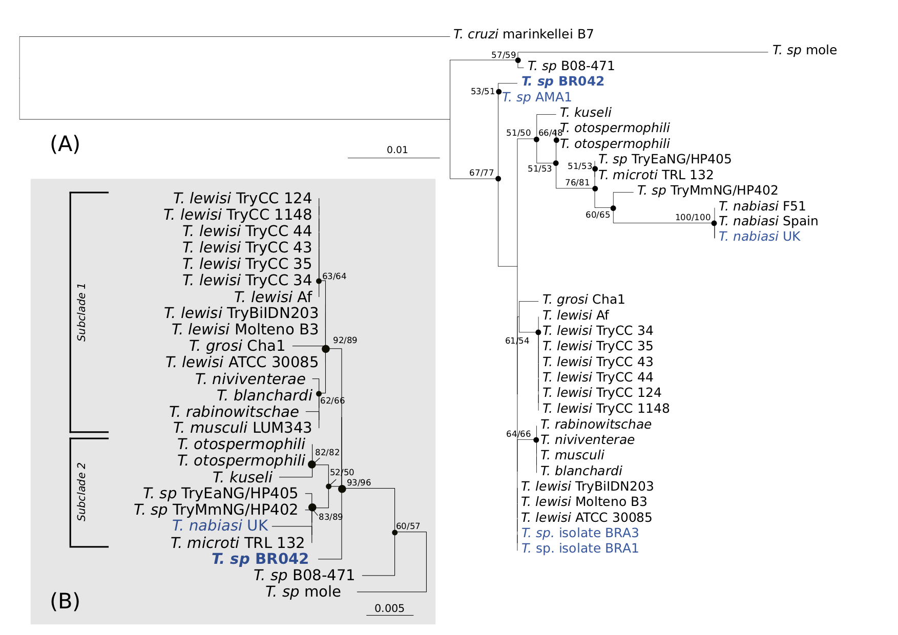
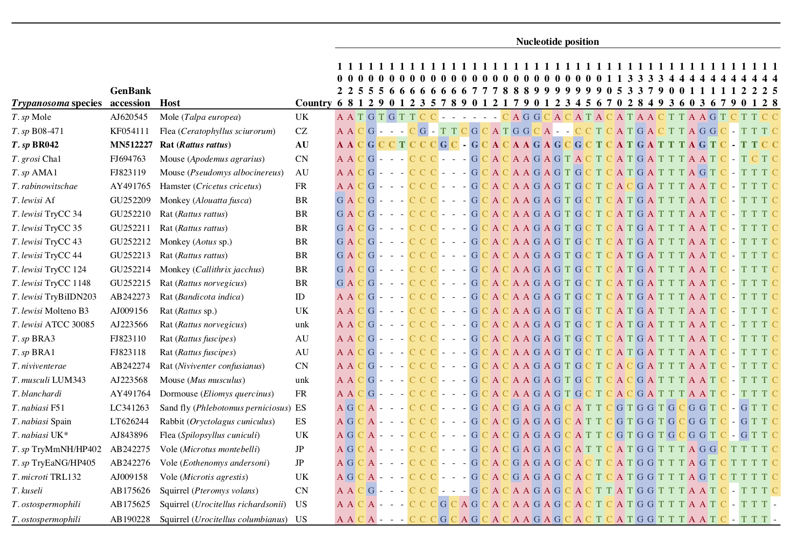

---
output:
  #bookdown::html_document2: default
  #bookdown::word_document2: default
  bookdown::pdf_document2: 
    template: templates/brief_template.tex
    citation_package: biblatex
documentclass: book
#bibliography: [bibliography/references.bib, bibliography/additional-references.bib]
---

# Black rat trypanosome {#black-rat}
\chaptermark{Rat trypanosome}

\newpage

## Preface {.unnumbered}

The following chapter has been drafted in accordance with the journal *Parasitology Research*. 

The following chapter has been published: **Egan, S.**, Taylor, C., Austen, J., Banks, P., Ahlstrom, L., Ryan, U., Irwin, P., and Oskam C. 2020. Molecular identification of the *Trypanosoma* (*Herpetosoma*) *lewisi* clade in black rats (*Rattus rattus*) from Australia. *Parasitology Research*, **119**, 1691--1696. DOI: [10.1007/s00436-020-06653-z](https://doi.org/10.1007/s00436-020-06653-z)

The following authors contributed to this manuscript as outlined below^[Contribution indicates the total involvement the author has had in this project. Placing an ‘X’ in the remaining boxes indicates what aspect(s) of the project each author engaged in.].

```{r include=FALSE}
library(readxl)
library(tidyverse)
attrib <- read_excel("front-and-back-matter/preface/attributions-blackrat.xlsx")
```
```{r, echo=FALSE}
library(kableExtra)
knitr::kable(attrib, booktabs = TRUE, linesep = "") %>%
  kable_styling(font_size = 7.0) %>%
  kable_styling(latex_options = c("striped", "hold_position"))
```

By signing this document, the Candidate and Principal Supervisor acknowledge that the information provided is accurate and has been agreed to by all other authors. 

\vspace{3mm}

\raggedright

| __________________ &nbsp; &nbsp; &nbsp; __________________
|   Candidate &nbsp; &nbsp; &nbsp; &nbsp; &nbsp; &nbsp; &nbsp; &nbsp; &nbsp; &nbsp; &nbsp; &nbsp; &nbsp; &nbsp; &nbsp; &nbsp; Principal Supervisor

\newpage

**Chapter linking statement:** 
This chapter provides further molecular insights into *Trypanosoma lewisi*-like sequences that were identified from the blood of black rats in Sydney, New South Wales. This study provided the first molecular characterisation of members of the *Tr. lewisi*-clade from Australian black rats (*Rattus rattus*). It shows that Australia *Tr. lewisi*-like sequences were distinct from *Tr. lewisi* sensu stricto clade, and were most closely related to genotypes from Europe. As detection of this blood parasite included a site managed by the Australian Wildlife Conservatory where native wildlife are being re-introduced, this finding highlights the importance of on-going surveillance and management strategies in wildlife conservation.

\vspace{5mm}

**Funding and acknowledgment statement:** This study was part-funded by the Australian Research Council (LP160100200), Bayer HealthCare (Germany) and Bayer Australia. S.L.E. is supported by an Australian Government Research Training Program (RTP) Scholarship, C.L.T. is supported by a scholarship from the Northern Beaches Council. This project was also part supported by The Holsworth Wildlife Research Endowment & The Ecological Society of Australia (awarded to S.L.E.) and the Paddy Pallin Science Grant from The Royal Zoological Society (awarded to C.L.T.). We thank Jenna Bytheway, Dr. Henry Lydecker and the Australian Wildlife Conservancy ecologists Dr. Viyanna Leo and Mareshell Wauchope for their invaluable assistance in the field. We thank two anonymous reviewers for their constructive feedback.

\vspace{5mm}

**Data availability:**
Sequence generated in the present study has been submitted to GenBank nucleotide database under accession number MN512227.

\vspace{5mm}

**Author contributions::**
Conceptualisation: S.L.E., U.M.R., P.J.I., C.L.O.
Data curation: S.L.E., C.L.T.
Formal Analysis: S.L.E.
Funding acquisition: S.L.E., C.L.T., P.B.B., L.A.A., U.M.R., P.J.I., C.L.O.
Investigation: S.L.E., C.L.T., J.M.A.,
Methodology: S.L.E., C.L.T., J.M.A.
Project administration: P.J.I., C.L.O.
Resources: A.S.N., P.B.B., P.J.I., C.L.O.
Software: S.L.E.
Supervision: P.B.B., U.M.R., P.J.I., C.L.O.
Visualisation: S.L.E.
Writing – original draft: S.L.E.
Writing – review & editing: S.L.E, C.L.T., P.B.B., A.S.N., L.A.A., U.M.R., P.J.I., C.L.O.

\vspace{5mm}

**Keywords:** *Trypanosoma lewisi*; *Rattus rattus*; Australia; black rats; ship rats

\newpage

## Abstract

Invasive rodent species are known hosts for a diverse range of infectious microorganisms and have long been associated with the spread of disease globally. The present study describes molecular evidence for the presence of a *Trypanosoma* sp. from black rats (*Rattus rattus*) in northern Sydney, Australia. Sequences of the 18S ribosomal RNA (rRNA) locus were obtained in two out of eleven (18%) blood samples with subsequent phylogenetic analysis confirming the identity within the *Trypanosoma lewisi* clade.

## Introduction

Black rats (*Rattus rattus*) are distributed throughout the world and considered one of the most significant invasive species. Current evidence indicates the Rattus genus originated from Southeast Asia [@aplinMultipleGeographicOrigins2011], with black rats establishing in Australia alongside European settlement during the 1770's, although the precise date of their first arrival on the continent is unclear [@banksReviewEvidencePotential2012]. Black rats can act as amplifying hosts for a diverse range of pathogens that can affect humans, wildlife and domestic animals and a recent review of black rats in Europe identified at least 20 zoonotic infectious agents associated with the species [@strandRatborneDiseasesHorizon2019]. However, despite the global recognition of these rodents as hosts of pathogens, there is a relatively limited understanding of the range of infectious agents present in Australian populations of black rats [@banksReviewEvidencePotential2012].

Trypanosomes are a group of flagellate protozoan parasites, the vast majority of which are transmitted by blood-feeding invertebrates. Worldwide at least 44 trypanosome species are known to infect rodents (as reviewed by Dybing et al. [-@dybingGhostsChristmasAbsence2016]). Due to the morphological similarities within the *Trypanosoma* subgenus *Herpetosoma* [@maiadasilvaPhylogeneticMorphologicalBehavioural2010; @ortizDiagnosisGeneticAnalysis2018], records based on microscopic observations alone may underestimate the diversity of trypanosome species infecting rodents; the number is likely to increase with more frequent application of molecular methodologies in contemporary studies. *Trypanosoma* (*Herpetosoma*) lewisi almost exclusively utilises a *Rattus* sp. host and is commonly vectored by rodent fleas, *Xenopsylla cheopis* and *Nosopsyllus fasciatus* [@ortizDiagnosisGeneticAnalysis2018]. While members of this subgenus are largely considered non-pathogenic in their respective hosts, infections have been identified in a number of other mammalian species, including humans [@maiadasilvaPhylogeneticMorphologicalBehavioural2010; @ortizDiagnosisGeneticAnalysis2018]. In Australia, recent research has revealed the presence of several novel trypanosomes infecting native Australian marsupials [@thompsonTrypanosomesAustralianMammals2014], however investigation into the presence of trypanosomes in Australian rodents, either native or introduced, has been absent in recent years.

The results shared in this short communication form part of a broader investigation into vector-borne microorganisms present in Australia. To the authors' knowledge, this study provides the first molecular identification of *Trypanosoma lewisi*-like organisms from black rats on mainland Australia.

## Methods

Small mammal trapping was conducted during April and May 2019 at two sites in northern Sydney, NSW, Australia; Irrawong Reserve and Warriewood Wetlands, Warriewood (-31.69, 151.28) and North Head, Manly (-33.81, 151.29). Two transects of 20 trap stations were set up at each site, with each station including one Elliot type B trap (46 x 15.5 x 15 cm) and one medium sized cage trap (72 x 32 x 31 cm) to target small and medium sized mammals. Traps were baited with peanut butter and oat balls and set for three consecutive nights. The trapping and sampling were conducted with approval of the Animal Ethics Committees of the University of Sydney (Permit number 2018/1429) and Murdoch University (Permit number R3026/18), respectively. Venous blood was collected into 1 mL EDTA tubes for the detection of haemoparasites. Thin blood smears were prepared and stained with modified Wright-Giemsa. Blood films were inspected by light microscopy (Olympus BX51) for the presence of trypanosomes at x 400 magnification and under oil immersion (x 1000). Total genomic DNA was extracted from 200 $\mu L$ of blood using a MasterPure DNA purification kit (Epicentre\textregistered Biotechnologies, Madison, Wisconsin, U.S.A) following the manufacturer's recommendations. Where 200 $\mu L$ of blood was not available, PBS was used to make samples up to 200 $\mu L$ DNA was eluted in 30 $\mu L$ of TE buffer and stored at -20 $^\circ$C.

Blood samples were screened for the presence of *Trypanosoma* spp. using a nested PCR approach targeting a \~550 bp product of the 18S ribosomal RNA (rRNA) gene with external primers TRY927F / TRY927R and internal primers SSU561F / SSU561R, as previously described [@noyesNestedPCRSsrRNA1999]. Reactions were carried out in 25 $\mu L$ volumes, 2 $\mu L$ of undiluted gDNA was added to the primary PCR and 1 $\mu L$ of the primary product was used as a template for the secondary assay. PCR products were electrophoresed on a 1% agarose gel stained with SYBR safe (Invitrogen, USA), and amplicons of the correct size were excised and purified using previously described methods [@yangSpecificQuantitativeDetection2013]. Sanger sequencing was carried out using internal primer sets in both directions and sequencing was performed at the Australian Genome Research Facility (Perth, Australia). Samples that returned a positive identification for *Trypanosoma lewisi*-like were further investigated. A near full-length fragment of the 18S rRNA locus was obtained using two nested PCR assays. Reactions were carried out in 25 $\mu L$ volumes using external primers SLF / S762 and internal primer sets S823 / S662 and S825 / SLIR as described [@mcinnesTrypanosomaIrwiniSp2009]. Gel electrophoresis and Sanger sequencing using internal primers in both directions were carried out as above. No-template and extraction controls were included throughout the laboratory processes. Extractions, pre-PCR and post-PCR procedures were performed in laboratories physically separated from each other in order to minimise the risk of contamination. In addition, no *Tr.lewisi* species have been previously isolated or amplified in the specific laboratories used.

Sequences were subject to BLAST analysis to identify the most similar species and genotypes. Nucleotide sequences from the *Trypanosoma Herpetosoma* subgenus were retrieved from GenBank [@bensonGenBank2017] and aligned with sequences obtained in the present study using MUSCLE [@edgarMUSCLEMultipleSequence2004]. The final alignments were imported into MEGA 7 [@kumarMEGA7MolecularEvolutionary2016], and the most appropriate nucleotide selection model was selected using the dedicated feature based on the Bayesian Information Criterion (BIC). Phylogenetic reconstruction was conducted in MEGA7 using maximum likelihood (ML) and neighbour-joining (NJ) analyses, missing data and positions containing gaps were eliminated. Alignments of the *Herpetosoma* subgenus at the 18S v7-8 hypervariable region were also inspected for nucleotide differences. Genetic distances were calculated using the Kimura model [@edgarMUSCLEMultipleSequence2004].

## Results and discussion

A total of 47 animals were captured over the trap period. Blood samples were collected from 11 black rats from Warriewood Wetlands (n=4), and North Head (n=7). Black rats were distinguished from *Rattus fuscipes* and *Rattus norvegicus* by their slender body, elongated head, large ears and pointed nose as per Menkhorst and Knight [-@menkhorstFieldGuideMammals2011]. Two rat samples from North Head were positive for *Trypanosoma* species by molecular methods, and of these a blood smear was only available in one case, however no trypomastigote stages were observed by light microscopy despite prolonged searching of the cell layer. Black rat samples that were negative for molecular evidence of trypanosomes were also screened by microscopy and, no organisms were detected. The absence of a morphological identification in this report is disappointing, however it is not unexpected as previous studies have noted that rats (*R. rattus*) experimentally infected with *Tr.lewisi* transit from an acute phase where parasites multiply rapidly, followed by a chronic phase, during which parasite numbers progressively diminish and may disappear from circulation altogether [@mackerrasHaematozoaAustralianMammals1959].

Initial screening produced \~550 bp product of the 18S rRNA gene in samples BR042 and BR048, these sequences were 100% identical to each other. A near full length 18S rRNA sequence (1,928 bp) was obtained from both samples also confirming that the sequences were 100% identical and a representative sequence of the 18S rRNA gene from sample BR042 was used for phylogenetic purposes (GenBank accession MN512227). Analyses using BLAST showed sequences were highly similar (\>98% identity) to the *Herpetosoma* subgenus.

```{r F51, out.width='95%', out.align = 'left',fig.scap = "Phylogeny of \\textit{Trypanosoma Herpetosoma} subgenus based on the 18S rRNA locus.", fig.cap = "Maximum likelihood phylogenetic reconstruction of \\textit{Trypanosoma Herpetosoma} subgenus based on the 18S rRNA locus. Evolutionary relationship inferred using the Kimura 2-parameter (K2P) + G substitution model with 1,000 bootstrap replicates. Node support values shown for ML and Neighbour-Joining (NJ) analyses respectively, values <50 have been hidden. All positions containing gaps and missing data were eliminated. (a) phylogeny based on short alignment (483 bp) of V7-8 hyper-variable region of the 18S locus (b) phylogeny based on longer alignment (1,491 bp) of 18S locus, outgroup to \\textit{Tr.cruzi} (AJ009150) not shown. Number of substitutions per nucleotide position is represented by the scale bar. New sequence from the present study is designated in bold. Sequences from Australia in blue \\textit{Tr.nabiasi} UK isolate (AJ843896) is identical to sequences obtained from Australian wild rabbits (\\textit{O. cuniculus}) and their fleas (\\textit{S. cuniculi}) (see Hamilton et al., 2005).", echo=FALSE}

```

Phylogenetic analysis of the shorter (483 bp) 18S rRNA gene alignment was used in order to include a greater variety of reference sequences, in particular for the context of the present study to include the only other *Tr.lewisi*-like sequences from Australia [@hamiltonInadvertentIntroductionAustralia2005; @averisDiversityDistributionHostparasite2009]. Figure \@ref(fig:F51) shows the phylogeny of the *Trypanosoma* *Herpetosoma* subgenus. As demonstrated by the polytomy present in Figure \@ref(fig:F51)a, this short region of the 18S rRNA gene is insufficient in the differentiation of members within the *Tr.lewisi* clade. Due to the speed at which the 18S rRNA locus has evolved, short regions of this locus have been reported as being unsuitable for inference of evolutionary relationships between *Trypanosoma* species [@hamiltonResolvingRelationshipsAustralian2011].

Reconstruction of phylogenetic relationships over a longer region (1,491 bp) of the 18S rRNA gene exhibited superior resolution within the *Tr.lewisi* clade Figure \@ref(fig:F51)b. In this phylogeny, sequences obtained from Australian black rats in the present study did not fall within the *Tr.lewisi* sensu stricto clade; instead they formed a distinct group of sequences that branched separately from other reference sequences. Pairwise distance analysis over a 1,491 bp alignment of the 18S rRNA gene demonstrated sequences from the black rat were 99.5% similar to *Trypanosoma microti* (AJ009158). The next most similar sequences were *Trypanosoma* sequences from voles in Japan (AB242275, AB242276) and a flea from Czech Republic (KF054111), all of which were 99.4% similar. Members of the *Tr.lewisi* sensu stricto clade, as shown in Figure \@ref(fig:F52), were all 100% identical to each other over the 1,491 bp alignment. These were the third most similar sequences (99.3%) to the *Trypanosoma* sp. identified in the present study. Inspection of a 433 bp alignment at the V7-8 18S hyper-variable region (Figure \@ref(fig:F52)), demonstrated that the most similar trypanosome sequence to that obtained in this study were those from a native Australian mouse in the south-west of Western Australia (*Pseudomys albocinereus*) (FJ823119) with seven single nucleotide polymorphisms (SNPs).

The phylogeny in the present study supports previous research by Hamilton et al. [-@hamiltonInadvertentIntroductionAustralia2005] that demonstrated the *Tr.lewisi* clade can be divided into two subclades, consisting of *Tr.lewisi*, *Tr.musculi*, *Tr.rabinowitschae*, *Tr.blanchardi* and *Tr.grosi* in subclade one and *Tr.nabiasi*, *Tr.microti*, and *Tr.otospermophili* in subclade two. Trypanosome sequences obtained in the present study from Australian black rats form a paraphyletic group to the two monophyletic *Tr.lewisi* clades. Despite the basal position in the phylogenetic tree, genetic distances show a high similarity to *Tr.lewisi* subclade two.

```{r F52, out.width='95%', out.align = 'left',fig.scap = "Nucleotide alignment of \\textit{Trypanosoma lewisi} clade.", fig.cap = "Polymorphic sites within the V7-8 hyper-variable region of the 18S rRNA locus (433 bp) for trypanosomes of the subgenus \\textit{Herpetosoma}. \\textit{Tr.nabiasi} UK isolate (AJ843896) is identical to sequences obtained from Australian wild rabbits (\\textit{O. cuniculus}) and their fleas (\\textit{S. cuniculi}) (see Hamilton et al., 2005). Country abbreviations; Australia (AU), Brazil (BR), China (CN), Czech Republic (CZ), France (FR), Indonesia (ID), Japan (JP), Spain (ES), United Kingdom (UK), United States of America (US), unknown (unk).", echo=FALSE}

```

Morphological identification of rodent trypanosomes in Australia, attributed to *Tr.lewisi*, was first made by T. L. Bancroft in 1888 in black rats in Brisbane [@mackerrasHaematozoaAustralianMammals1959], with subsequent records by various scientists who confirmed the presence of this parasite in; Brisbane by Pound (1905), in Perth by Cleland (1906, 1908), and in Sydney by Johnston (1909) (all cited by Mackerras [-@mackerrasHaematozoaAustralianMammals1959]). Trypanosomes presumed to be *Trypanosoma* *lewisi* were first identified in native Australian fauna by Mackerras [-@mackerrasCatalogueAustralianMammals1958a]. Morphological detection of the parasite has been made from the bush rat (*Rattus fuscipes*; Queensland) and the water rat (*Hydromys chrysogaster*; Queensland) [@mackerrasHaematozoaAustralianMammals1959; @mackerrasCatalogueAustralianMammals1958a]. More recently, molecular reports of *Trypanosoma* species from the *Tr.lewisi* clade have been made from native wildlife in Western Australia, including two bush rats (*Rattus fuscipes*), a dibbler (*Parantechinus apicalis*) and an ash-grey mouse (*Pseudomys albocinereus*) [@averisDiversityDistributionHostparasite2009]. Interestingly, despite sampling from 371 native mammals, 19 different species and 14 sites, detection of *Tr.lewisi*-like species was confined only to mammals from Fitzgerald River in the south-west of Australia. The identification of *Tr.lewisi*-like spp. by Averis et al. [-@averisDiversityDistributionHostparasite2009] was limited by the short size of the 18S rRNA gene analysed (444 bp). As demonstrated in the present study, across a short region of the 18S rRNA gene, trypanosomes within the *Tr.lewisi* clade can share a high sequence similarity (Figure \@ref(fig:F51)), however upon more robust analysis of a longer fragment it is evident that sequences within the *Tr.lewisi* clade form distinct groups. Additional genetic information (e.g. glycosomal glyceraldehyde-3-phosphate dehydrogenase (gGAPDH)) will also assist in determining the phylogenetic relationships of these closely related species in future studies.

The genetic relationship of the Australian isolate BR042 to *Tr.microti*, a trypanosome isolated from a vole (*Microtis agrestis*) in England suggest that the *Tr.lewisi* isolates from this study are closely related to rodent trypanosomes in the subgenus *Herpetosoma* from Europe. This agrees with finding by Hamilton et al. [-@hamiltonEvolutionTrypanosomaCruzi2012] reporting that Australian trypanosomes appear to be more closely related to trypanosomes outside of Australia than to each other. This observation is consistent with the hypothesis that some trypanosomes have been introduced into the Australian continent comparatively recently, rather than this trypanosome evolving in Australia following the breakup of Gondwana; *Trypanosoma lewisi* (known to be host specific) likely arrived in Australia with black rats when individuals colonised the mainland. Additionally, Hamilton et al. [-@hamiltonInadvertentIntroductionAustralia2005] detected European *Tr.nabiasi* (from the *Tr.lewisi* clade) in Australian wild rabbits (*Oryctolagus cuniculus*) suggesting that these parasites may have been brought into Australia with the first 24 rabbits introduced from England in 1859 [@hamiltonInadvertentIntroductionAustralia2005].

The introduction of black rats and their associated trypanosomes to regions previously free of these species has long been considered responsible for the extinction of two native rat species *Rattus macleari* and *Rattus nativitatis*, as occurred on Christmas Island (an island Australian Territory located in the Indian Ocean, south of Indonesia) [@wyattHistoricalMammalExtinction2008]. Recent research has since concluded that the rapid decline and extinction of the two endemic rat species was correctly attributed to infections with *Tr.lewisi* [@wyattHistoricalMammalExtinction2008]. A review of historical records demonstrated a rapid extinction event following the arrival of black rats on the island in September 1900 and an absence of native rat sightings by October 1904 [@greenMammalExtinctionIntroduced2014]. A recent study by Dybing et al. [-@dybingGhostsChristmasAbsence2016] investigated the presence of *Trypanosoma* and *Leishmania* spp. from feral cats (*Felis catus*) and black rats (*R. rattus*) on Christmas Island. Through molecular analysis of spleen samples, the study did not detect any *Trypanosoma* or *Leishmania* species. In addition, the same study reported an absence of these parasites from feral cat samples from Dirk Hartog Island and sites from south-west Western Australia.

North Head is situated at the entrance to the Sydney harbour and is dominated by Eastern Suburbs banksia scrub, an endangered ecological community [@perkinsEasternSuburbsBanksia2012]. Following European arrival, the headland was used to quarantine arriving ship passengers. In addition to being home to endangered populations of long-nosed bandicoots (*Perameles nasuta*) and little penguins (*Eudyptula minor*), reintroductions of native fauna species, such as bush rats (*Rattus fuscipes*), eastern pygmy possums (*Cercartetus nanus*) and brown antechinus (*Antechinus stuartii*), have also occurred at this site. While, to date, there is no evidence of a spill-over of trypanosomes within the *Tr.lewisi* clade to native species, ongoing monitoring of such populations is advised given the historical significance of this parasite with respect to native animal declines [@greenMammalExtinctionIntroduced2014; @wyattHistoricalMammalExtinction2008].

In addition to trypanosomes, black rats may act as reservoirs for many other sources of infectious agents [@banksReviewEvidencePotential2012]. Additional information regarding the presence, distribution and diversity of pathogens harboured by black rats in Australia is critical to understanding the dynamics of pathogen spill-over [@beckerDynamicIntegrativeApproaches2019]. Future research encompassing both morphological and molecular techniques is on-going by the authors. Collection of ectoparasites, blood, and tissue samples from both native and introduced wildlife will likely continue to shed light on the diversity and distribution of vector-borne microorganisms impacting wildlife, domestic animals and humans.
