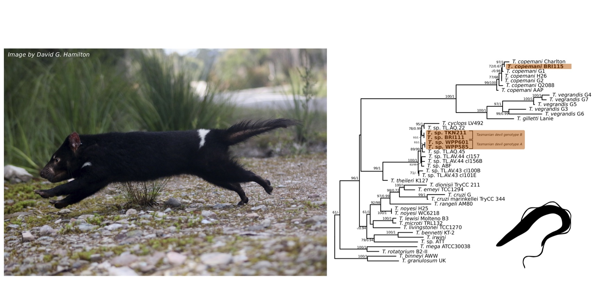
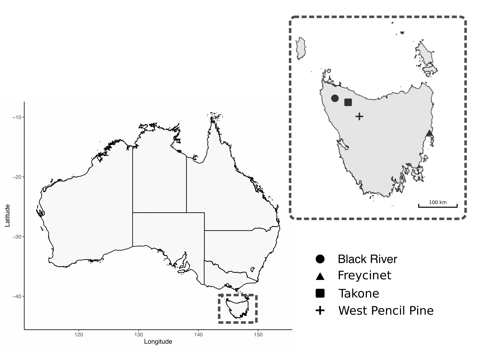
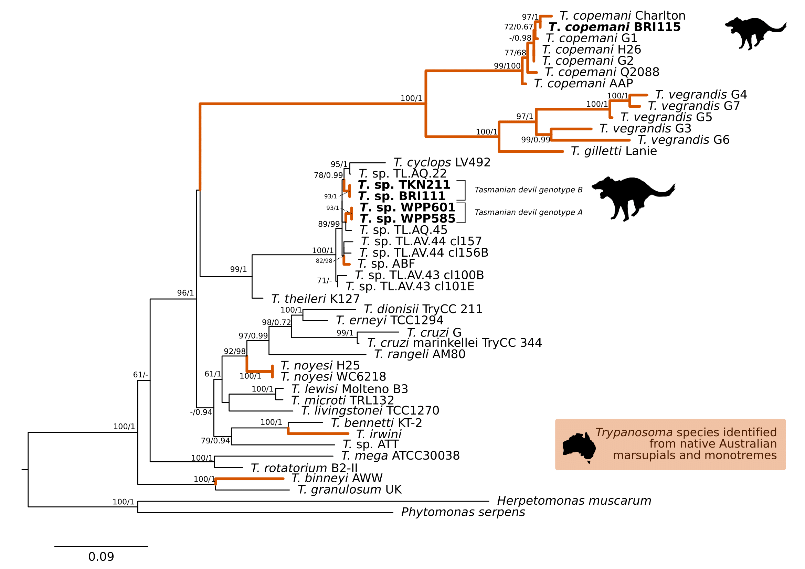
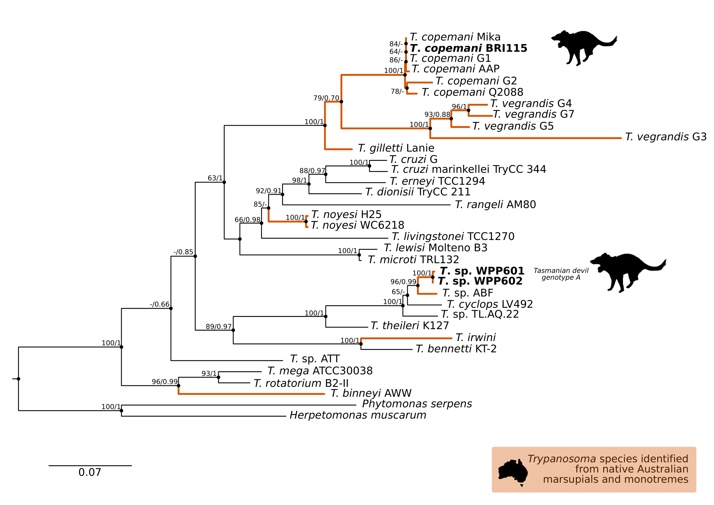
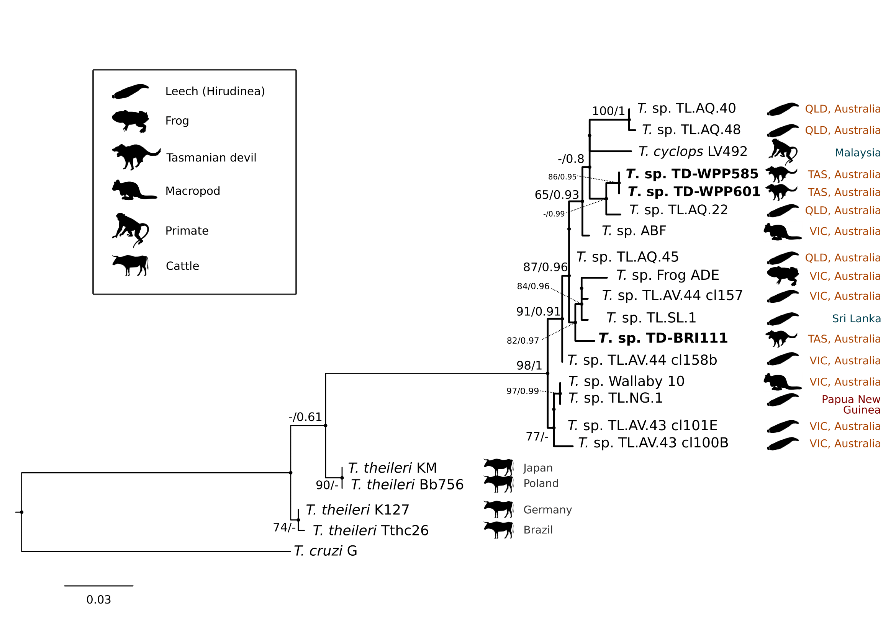

---
output:
  #bookdown::html_document2: default
  #bookdown::word_document2: default
  bookdown::pdf_document2: 
    template: templates/brief_template.tex
    citation_package: biblatex
documentclass: book
#bibliography: [bibliography/references.bib, bibliography/additional-references.bib]
header-includes:
- \usepackage{booktabs}
- \usepackage{longtable}
- \usepackage{array}
- \usepackage{multirow}
- \usepackage{wrapfig}
- \usepackage{float}
- \usepackage{colortbl}
- \usepackage{pdflscape}
- \usepackage{tabu}
- \usepackage{threeparttable}
- \usepackage{threeparttablex}
- \usepackage[normalem]{ulem}
- \usepackage{makecell}
- \usepackage{xcolor}
- \usepackage{pdflscape}
---
  
# Tasmanian devil haemoprotozoa {#tas-devil}
\chaptermark{Devil haemoprotozoa}


```{r F6preface, out.width='100%', out.align = 'left', echo=FALSE}

```

\newpage

## Preface {-}

**Attribution Statement**

The following chapter has been drafted in accordance with the journal *Pathogens*. 

The following manuscript has been published: **Egan, S.**,  Ruiz-Aravena, M., Austen, J., Barton, X., Comte, S., Hamilton, D., Hamede, R., Ryan, U., Irwin, P., Jones, M., and Oskam, C. *2020*. Blood parasites in endangered wildlife: trypanosomes discovered during a survey of haemoprotozoa from the Tasmanian devil. *Pathogens*, **9**(11), 873. DOI: [10.3390/pathogens9110873](https://doi.org/10.3390/pathogens9110873)

The following authors contributed to this manuscript as outlined below^[Contribution indicates the total involvement the author has had in this project. Placing an ‘X’ in the remaining boxes indicates what aspect(s) of the project each author engaged in.].

```{r include=FALSE}
library(readxl)
library(tidyverse)
attrib <- read_excel("front-and-back-matter/preface/attributions-tasdevil.xlsx")
```
```{r, echo=FALSE}
library(kableExtra)
knitr::kable(attrib, booktabs = TRUE, linesep = "") %>%
  kable_styling(font_size = 7.0) %>%
  kable_styling(latex_options = c("striped", "hold_position"))
```

By signing this document, the Candidate and Principal Supervisor acknowledge that the information provided is accurate and has been agreed to by all other authors. 

\vspace{3mm}

\raggedright

| __________________ &nbsp; &nbsp; &nbsp; __________________
|   Candidate &nbsp; &nbsp; &nbsp; &nbsp; &nbsp; &nbsp; &nbsp; &nbsp; &nbsp; &nbsp; &nbsp; &nbsp; &nbsp; &nbsp; &nbsp; &nbsp; Principal Supervisor

\newpage

**Chapter linking statement:**
This chapter comprises a collaborative research project with the University of Tasmania. The Tasmanian devil is the largest extant carnivore and experience devastating declines due to a transmissible cancer known as devil facial tumour disease (DFTD). In this study we provide the first molecular survey of blood parasites in the Tasmanian devil. This research provide important important insights into the diversity of haemoprotozoa and ground work for future research to further understand the clinical impacts and interactions with DFTD. In addition in the broader context of this thesis this research is also of interest into zoonoses, and builds on the theme of wildlife surveillance. As as large carnivore devils fill a unique niche and could serve as an important reservoir for zoonotic pathogens. These findings further add to research that shows Australian wildlife harbor unique parasites that are endemic to Australia and surrounds, adding the growing research that Australia is free of many known pathogens described over seas.

\vspace{5mm}

**Acknowledgement statement:** 
We thank Sarah Munns for extraction of DNA and A/Prof Chris Peacock (The University of Western Australia) for provision of *Leishmania macropodum* control. We acknowledge the generous support of the large number of volunteers who assisted with fieldwork and data collection.

\vspace{5mm}

**Funding statement:** This study was part-funded by the Australian Research Council (LP160100200), Bayer HealthCare (Germany) and Bayer Australia. S.L.E. was supported by an Australian Government Research Training Program (RTP) Scholarship. This project was also part supported by The Holsworth Wildlife Research Endowment & The Ecological Society of Australia (awarded to S.C. and S.L.E). Fieldwork and data collection were funded by the US National Institute of Health (R01-GM126563-01), the Save the Tasmanian Devil Appeal of the University of Tasmania Foundation (Eric Guiler Grant Scheme) and the Australian Research Council (DE170101116).

\vspace{5mm}

**Data availability:** Sequences generated in the present study have been submitted to GenBank nucleotide database under accession numbers MT883295 – MT883326 (trypanosome *18S rRNA*), MT514664 – MT514666 (trypanosome *GAPDH*) and MW084364 (*Babesia* *18S rRNA*).

\vspace{5mm}

**Keywords:** Tasmanian devil; *Sarcophilus harrisii*; Haemoprotozoa; *Trypanosoma*; Marsupial; Devil facial tumour disease (DFTD)

\newpage

## Abstract

The impact of emerging infectious diseases is increasingly recognised as a major threat to wildlife. Wild populations of the endangered Tasmanian devil, *Sarcophilus harrisii*, are experiencing devastating losses from a novel transmissible cancer, devil facial tumour disease (DFTD), however, despite the rapid decline of this species there is currently no information on the presence of haemoprotozoan parasites. In the present study, 95 Tasmanian devil blood samples were collected from four populations in Tasmania, Australia, which underwent molecular screening to detect four major groups of haemoprotozoa: (i) trypanosomes, (ii) piroplasms, (iii) *Hepatozoon* and (iv) haemosporidia. Sequence results revealed *Trypanosoma* infections in 32/95 individuals. *Trypanosoma copemani* was identified in 10 Tasmanian devils from three sites and a second *Trypanosoma* sp. was identified in 22 individuals that grouped within the poorly described *Tr. cyclops* clade. A single blood sample was positive for *Babesia* sp. that most closely matched *Babesia lohae*. No other blood protozoan parasite DNA was detected. This study provides the first insight into haemoprotozoa from the Tasmanian devil and the first identification of *Trypanosoma* and *Babesia* in this carnivorous marsupial.

## Introduction

Haemoprotozoan parasites are unicellular eukaryotic organisms with complex lifecycles involving an invertebrate vector and often alternate in their tropism between the tissues and the blood of their vertebrate hosts. Four major haemoprotozoan assemblages infect mammals [@odonoghueHaemoprotozoaMakingBiological2017]; (i) Trypanosomatids (Kinetoplastea), which are flagellated protists characterised by the presence of a unique organelle, the kinetoplast; (ii) haemogregarines (Adeleorina); (iii) haemosporidia (Haemosporidia); and (iv) piroplasms (Piroplasmida). Broadly haemoprotozoans are considered either host specific (e.g. *Theileria ornithorhynchi* infecting the platypus (*Ornithorhynchus anatinus*) host [@papariniFirstMolecularCharacterization2015]) or generalists (e.g. *Trypanosoma cruzi* which infects a wide range of mammals [@clementOutAfricaOrigins2020]). However, the true diversity and epidemiology of most of these species remains unknown.

The Tasmanian devil, *Sarcophilus harrisii*, is the largest extant marsupial carnivore. Once present across mainland Australia (~3,000 years ago), the distribution of wild populations of Tasmanian devils became restricted to the island of Tasmania [@bruniche-olsenAncientDNATracks2018], off the southern coast of the Australian mainland. Biogeographical events have influenced declines in the effective size of devil populations and their distribution, with consequential genetic bottleneck resulting in low genetic diversity  [@jonesGeneticDiversityPopulation2004;@bruniche-olsenAncientDNATracks2018;@pattonContemporaryDemographicReconstruction2019]. Since 1996, a transmissible cancer (devil tumour facial disease, DFTD hereafter) gradually spread across most of the distributional range of the species and caused local population declines of upwards of 80% [@mccallumTransmissionDynamicsTasmanian2009;@lazenbyDensityTrendsDemographic2018]. Transmission of DFTD occurs through direct transfer of live tumour cells between individuals when devils bite each other during social interactions [@pearseAllograftTheoryTransmission2006;@hamedeBitingInjuriesTransmission2013;@hamiltonRateIntersexualInteractions2019]. Survival in DFTD infected individuals is usually 6-12 months after clinical signs appear; the disease is lethal in almost 100% of cases [@pyeDevilFacialTumor2016]. As a consequence of transmission being driven by social interactions, DFTD is still present even in largely depleted populations of hosts [@mccallumTransmissionDynamicsTasmanian2009]. Therefore, any additional pressure(s) on the host health, such as co-infections with haemoparasites, could further threaten imperilled populations, yet, little is known about the devil’s parasite community [@waitReviewParasitesTasmanian2017].

To date, only four protozoan parasite groups have been identified from wild devil populations; *Cryptosporidium* spp., *Giardia* spp., *Toxoplasma gondii* and *Sarcocystis* sp. A previous study identified sporulated sporocysts consistent with *Sarcocystis* (family: Sarcocystidae) species from the intestinal mucosa using microscopic examination [@mundaySarcocystisRelatedOrganisms1978]. In north-west Tasmania, *T. gondii* prevalence was higher in carnivorous marsupials such as the Tasmanian devil, spotted-tail quoll (*Dasyurus maculatus*) and eastern quoll (*D. viverrinus*), compared to sympatric prey marsupials like the brushtail possum (*Trichosurus vulpecula*), Bennett’s wallaby (*Notamacropus rufogriseus*, syn. *Macropus rufogriseus*) and Tasmanian pademelon (*Thylogale billardierii*) [@hollingsWildlifeDiseaseEcology2013]. Recently, *Cryptosporidium* and *Giardia* spp. were also identified from faecal samples of wild devils using molecular techniques [@waitMolecularCharacterizationCryptosporidium2017].

Over the past two decades the use of molecular techniques has significantly extended our understanding of haemoprotozoan parasites. As a result, it has revealed that Australian marsupials and monotremes can host a high diversity of haemoprotozoa species, most of which are unique to Australia [@thompsonTrypanosomesAustralianMammals2014;@austenInvestigationMorphologicalDiversity2015;@barbosaSequenceAnalysesMitochondrial2019;@northoverIncreasedTrypanosomaSpp2019]. The clinical effects of co-infections in wildlife are often difficult to evaluate. One well documented case is the investigation into a canine distemper virus epidemic in Serengeti lions (*Panthera leo*), which identified that joint infection by haemoprotozoa was a major contributing factor to fatal outcomes [@munsonClimateExtremesPromote2008]. While there are limited studies on the clinical and pathological consequences of such interactions in native Australian wildlife, there is evidence that co-infection and co-morbidities can place species at an increased risk of disease when challenged with infection of haemoprotozoa [@mcinnesPotentialImpactNative2011;@boteroTrypanosomesGeneticDiversity2013;@thompsonTemporalSpatialDynamics2014].

The present study aimed to screen blood samples from Tasmanian devils for the presence of haemoprotozoan parasites. To the authors’ knowledge the present study provides the first survey of haemoprotozoa from Tasmanian devils. 


## Materials and Methods

### Study sites and sampling

Animal use was approved by the University of Tasmania Animal Ethics Committee permit numbers A0015835 and A0016789) and the Department of Primary Industries, Parks, Water and Environment Animal Ethics Committee (permit numbers TFA19144 and TFA18028).

A total of 95 blood samples were collected from wild Tasmanian devils captured during the austral autumn (May 2018) from four sites across Tasmania: Black River, Takone, West Pencil Pine and Freycinet (Figure \@ref(fig:F61)). The sampling effort at each site involved deployment of 40 PVC pipe traps during 7 to 10 consecutive nights. Individual devils were identified via subcutaneously implanted microchips (AllFlex$\copyright$ ISO FDX-B). 

Blood was collected (between 0.3-1 mL) from either the jugular vein (Takone) or marginal ear vein (Black River, Freycinet and West Pencil Pine). The puncture site was disinfected with sterile alcohol swabs for at least 15 seconds prior to collection and blood was stored in ethylenediaminetetraacetic acid (EDTA) vacutainers. Samples were kept refrigerated at 4$^\circ$C and shipped to Murdoch University, Western Australia where they were stored at -20$^\circ$C until analysis. 

```{r F61, out.width='95%', out.align = 'left',fig.scap = "Map of study sites for Tasmanian devil.", fig.cap = "Map of study sites for field collection of Tasmanian Devil \\textit{Sarcophilus harrisii}.", echo=FALSE}

```

### Molecular screening

#### DNA extraction

Total genomic DNA was extracted from 200 $\mu$L of blood using a MasterPure DNA purification kit (Epicentre\textregistered Biotechnologies, Madison, Wisconsin, U.S.A) following the manufacturer’s recommendations. Where 200 $\mu$L of blood was not available, sterile DNA free phosphate-buffered saline (PBS) was used to make samples up to 200 $\mu$L. Genomic DNA (gDNA) was eluted in 30 $\mu$L of TE buffer and stored at -20$^\circ$C. Extraction controls (EXBs) consisting of 200 $\mu$L sterile DNA free PBS, were included randomly in each extraction batch (N=7). 

#### PCR assays

Molecular screening was carried out for haemoprotozoa on gDNA from blood samples (N=95) and EXBs (N=7). Reactions were carried out in 25 $\mu$L volumes containing 2 $\mu$L of gDNA or 1 $\mu$L of the primary product for nested and semi-nested PCR assays. An overview of assays, including primer sequences, is available in Table \@ref(tab:T61).

(ref:primersT61) List of primers used for screening of haemoprotozoa from Tasmanian Devils (*Sarcophilus harrisii*). References: **1.** McInnes et al. [-@mcinnesTrypanosomaIrwiniSp2009], **2.** Maslov et al. [-@maslovPhylogenyTrypanosomesInferred1996], **3.** Jefferies et al. [-@jefferiesPCRRFLPDetectionDifferentiation2007], **4.** Ujvari et al.  [-@ujvariHighPrevalenceHepatozoon2004], **5.** Waldenstrom et al. [-@waldenstromNewNestedPolymerase2004], **6.** Bensch et al. [-@benschHostSpecificityAvian2000].

```{r include=FALSE}
library(tidyverse)
library(readr)
ch6_primers <- read_csv("tables/ch6-primers.csv")
# ch6_primers %>% 
#   mutate_all(~ replace_na(.x, ""))
```
```{r T61, echo=FALSE}
library(kableExtra)
opts <- options(knitr.kable.NA = "")
knitr::kable(ch6_primers, booktabs = TRUE, linesep = "", caption = "(ref:primersT61)", 
  caption.short = "Primers used for haemoprotozoa screening of Tasmanian devils.") %>%
  kable_styling(font_size = 8.5) %>%
  row_spec(c(1, 12, 17, 20),  bold = T)
```

For identification of trypanosomes (*Trypanosoma* and *Leishmania* spp.) samples were screened using a nested PCR assay targeting an ~959 bp product of the second half of the 18S ribosomal RNA (18S rRNA) locus. This assay amplifies most species of *Trypanosoma* [@mcinnesTrypanosomaIrwiniSp2009] and was also validated in the present study to amplify *Leishmania* spp. using control gDNA of *Leishmania infantum* from a canine bone marrow sample and *Leishmania macropodum* culture isolate. External primers SLF/S762R and internal primers S825F/SLIR were used as an initial screen and sequenced as per details below. Samples representative of the different genotypes identified then underwent an additional secondary assay with a second set of internal primers S823/S662R to yield a near full length *18S rRNA* sequence. Reactions were carried out in 25 $\mu$L volumes containing 0.4 $\mu$M of each primer and 12.5 $\mu$L GoTaq\textregistered Green master mix (Promega, U.S.A.). Thermal cycling conditions were as follows; initial cycle of 95$^\circ$C for 5 mins, 50$^\circ$C for 2 mins, 72$^\circ$C for 4 mins, followed by 35 cycles of 95$^\circ$C for 30 secs, 52$^\circ$C (primary) or 55$^\circ$C (secondary) for 30 secs, 72$^\circ$C for 2 mins 20 secs (primary) or 1 min (secondary), and a final extension of 72$^\circ$C for 5 mins. To obtain further phylogenetic information from the genotypes identified by 18S rRNA locus screening, samples underwent amplification of the glycosomal Glyceraldehyde Phosphate Dehydrogenase (*gGAPDH*) gene using a semi-nested PCR assay with external primers GAPDHF/GAPDHR and internal primers GAPDHF/Ga4 [@mcinnesTrypanosomaIrwiniSp2009]. Reactions contained 1X buffer (KAPA Biosystems, South Africa), 2.0 mM MgCl~2~, 0.4 $\mu$M of each primer, 0.25 mM of each dNTP, and 0.5 U of Taq (KAPA Biosystems, South Africa). Thermal cycling conditions were as follows; initial cycle of 95$^\circ$C for 5 mins, 50$^\circ$C for 2 mins, 72$^\circ$C for 4 mins, followed by 35 cycles of 95$^\circ$C for 30 secs, 52$^\circ$C (primary) or 55$^\circ$C (secondary) for 30 secs, 72$^\circ$C for 2 mins 20 secs, and a final extension of 72$^\circ$C for 5 mins. 

Screening for piroplasms (*Babesia* and *Theileria* spp.) utilised a previously described nested PCR assay. Primers were used targeting an ~800 bp product of the 18S rRNA locus with external primers BT1F/BT1R and internal primers BT2F/BT2R [@jefferiesPCRRFLPDetectionDifferentiation2007]. Reactions contained 1X buffer (KAPA Biosystems, South Africa), 2.0 mM MgCl~2~, 0.4 $\mu$M of each primer, 0.25 mM of each dNTP, and 0.5 U of Taq (KAPA Biosystems, South Africa). Thermal cycling conditions were as follows; initial cycle of 95$^\circ$C for 2 mins, 58$^\circ$C for 1 min, 72$^\circ$C for 2 mins, followed by 35 cycles of 95$^\circ$C for 30 secs, 62$^\circ$C for 20 secs, 72$^\circ$C for 45 secs, and a final extension of 72$^\circ$C for 7 mins. 

A genus specific assay for *Hepatozoon* targeting the 18S rRNA locus was used with primers HepF300/Hep900 to amplify an ~600 bp product [@ujvariHighPrevalenceHepatozoon2004]. Reactions contained 1X buffer (KAPA Biosystems, South Africa), 1.5mM MgCl~2~, 0.4 $\mu$M of each primer, 0.25 mM of each dNTP, and 0.5 U of Taq (KAPA Biosystems, South Africa). Thermal cycling conditions were as follows; initial denaturation of 95$^\circ$C for 3 mins, followed by 40 cycles of 95$^\circ$C for 30 secs, 60$^\circ$C for 30 secs, 72$^\circ$C for 1 min, and a final extension of 72$^\circ$C for 10 mins. 

Screening for haemosporidia (*Plasmodium* spp.) utilised a previously described nested PCR assay [@waldenstromNewNestedPolymerase2004]. Primers targeting an ~420 bp product of the *cytochrome b* (*cytb*) gene with external primers HAEMNF/HAEMNR2 and internal primers HAEMF/HAEMR2. Reactions contained 1X buffer (KAPA Biosystems, South Africa), 1.5 mM MgCl~2~, 0.4 $\mu$M of each primer, 0.25 mM of each dNTP, and 1.0 U of Taq (KAPA Biosystems, South Africa). Thermal cycling conditions were as follows; initial denaturation of 95$^\circ$C for 8 mins, followed by 35 cycles of 95$^\circ$C for 30 secs, 50$^\circ$C (primary) or 52$^\circ$C (secondary) for 30 secs, 72$^\circ$C for 45 secs, and a final extension of 72$^\circ$C for 10 mins. 

Suitable positive controls, extraction reagent blanks, and no-template PCR controls were included throughout the laboratory processes. Extractions, pre-PCR and post-PCR procedures were performed in laboratories physically separated from each other.

#### Gel electrophoresis and Sanger sequencing

Amplicons were electrophoresed on a 1% agarose gel stained with SYBR safe (Invitrogen, U.S.A.). Products of the correct size (see Table \@ref(tab:T61)) were excised from the gel and purified using previously described methods [@yangSpecificQuantitativeDetection2013]. Sanger sequencing was carried out in forward and reverse directions on all positive amplicons. Sequencing was performed at the Australian Genome Research Facility (Perth, Western Australia) on an Applied Biosystems 3730 using Big Dye Terminator chemistry version 3.1.

####  Phylogenetic analysis

Sequences were imported and trimmed in Geneious 10.2.6 (https://www.geneious.com) and then subjected to BLAST analysis using BLASTN 2.10.0+ [@zhangGreedyAlgorithmAligning2000] against nucleotide collection (nt) database [@morgulisDatabaseIndexingProduction2008] to identify the most similar species and genotypes. Reference sequences were retrieved from GenBank [@bensonGenBank2017] (details available in Table \@ref(tab:TA61)) and aligned with sequences obtained in the present study using MUSCLE [@edgarMUSCLEMultipleSequence2004]. Alignments of the *18S rRNA* and the *gGAPDH* sequences were then used for phylogenetic purposes. Phylogenies were inferred using the maximum likelihood (ML) method. The optimal evolutionary model was selected using ModelFinder [@kalyaanamoorthyModelFinderFastModel2017] based on bayesian information criterion. Phylogenetic analysis was performed in IQ-TREE v1.6.11 [@nguyenIQTREEFastEffective2015] and bootstrap support was calculated using ultrafast (UFBoot2) method with 10,000 replicates [@hoangUFBoot2ImprovingUltrafast2018].

Maximum likelihood phylogeny based on the 18S rRNA locus was performed using a 1,505 bp alignment based on the transition (AC=CG, AT=GT with equal base frequencies) (TIM3e) substitution model [@posadaUsingMODELTESTPAUP2003], with invariable sites (I=0.408) and a discrete gamma distribution (four categories) (G4=0.438) [@guMaximumLikelihoodEstimation1995]. To include a wider range of neighbouring reference sequences, a second phylogenetic analysis was performed on the V7-8 hypervariable region of the 18S rRNA locus; this region is useful to differentiate between closely related trypanosome sequences [@hamiltonResolvingRelationshipsAustralian2011]. A phylogeny was produced using a 559 bp alignment based on the Kimura Two-Parameter (K2P) substitution model [@kimuraSimpleMethodEstimating1980] with discrete gamma distribution (four categories) (G4=0.227) [@guMaximumLikelihoodEstimation1995]. A 767 bp alignment of the GAPDH gene was used for phylogenetic reconstruction based on the Tamura-Nei (TN) substitution model [@tamuraEstimationNumberNucleotide1993], with empirical base frequencies (F), invariable sites (I=0.387) and discrete gamma distribution (four categories) (G4=0.893) [@guMaximumLikelihoodEstimation1995]. Genetic sequence similarity was calculated using the Kimura Two-Parameter method [@tamuraEstimationNumberNucleotide1993].

Sequences generated in the present study have been submitted to GenBank nucleotide database under accession numbers MT883295--MT883326 (*Trypanosoma* *18S rRNA*), MT514664--MT514666 (*Trypanosoma* *GAPDH*) and MW084364 (*Babesia* *18S rRNA*).

### Statisical analysis

The overall prevalence of *Trypanosoma* species was compared between males and females using two-tailed Fisher Exact test.

### Microscopy of blood smears

Thin blood smears were prepared from animals sampled at Takone site only (three per individual), within 4 hours of collection, and then air dried and fixed in methanol. Blood smears were then stained with modified Wright-Giemsa (Hematek\textregistered Stain Pak) using a Hema-Tek Slide Stainer (Ames Company Division, Miles Laboratories Pty Ltd., Victoria, Australia) and a coverslip was mounted using DPX neutral mounting medium (LabChem, Victoria, Australia). Smears were inspected by light microscopy (Olympus BX51) for the presence of haemoprotozoa at x 400 magnification and under oil immersion (x 1000).

## Results

### Molecular screening

Molecular screening identified 33.7% (32/95) of the blood samples were positive for *Trypanosoma* DNA. Sequence identity from BLAST results identified; *Tr. copemani* and *Tr. cyclops*-like in 10.5% (n=10) and 23.2% (n=22) of the individuals respectively (Table \@ref(tab:T62)). *Trypanosoma* *copemani* was identified almost exclusively in males (90.0%, P=0.0159), while *Tr. cyclops*-like genotypes were more commonly found in females (68.2%, P=0.0432). All samples tested negative for presence of *Leishmania*, *Hepatozoon*, *Plasmodium* and *Theileria* species.


```{r include=FALSE}
library(readxl)
library(tidyverse)
ch6_prev <- read_excel("tables/ch6-prev.xlsx")
# ch6_prev %>% 
#   mutate_all(~ replace_na(.x, ""))
```

```{r T62, echo=FALSE}
library(kableExtra)
opts <- options(knitr.kable.NA = "")
knitr::kable(ch6_prev, booktabs = TRUE, linesep = "", caption = "Overview of Tasmanian devil sampling across survey sites showing number of individuals samples (n) and number of individuals positive for \\textit{Trypanosoma} species.", caption.short = "Trypanosome prevalence in Tasmanian devils.") %>%
  kable_styling(font_size = 8.5) %>%
  row_spec(5:5, bold = T)
```

Comparison at the *18S rRNA* V7-8 hypervariable region of the ten *Tr. copemani* sequences showed they were all >99% similar to each other, and as such a representative sample (BRI115) was used for subsequent phylogeny. 
Analysis of long *18S rRNA* alignment concluded that BRI115 sample shared 99.1% similarity to *Tr. copemani* Charlton (GU966588) and 98.5% with *Tr. copemani* H26 (AJ009169) (Figure \@ref(fig:F62)). 
At the gGAPDH locus BRI115 sample was identical to *Tr. copemani* Mika (GU966585), and 99.7% similar to *Tr. copemani* AAP (AJ620277) (Figure \@ref(fig:F63)). 
There is no *18S rRNA* sequence data for *Tr. copemani* Mika available. 
Comparison of *Tr. copemani* Charlton (GU966584) at the gGAPDH locus showed it was 99.9% similar to the BRI115 sample with one single nucleotide polymorphism (SNP) (data not shown). 
At the *18S rRNA* V7--8 hypervariable region two genotypes of the *Tr. cyclops* clade were identified, referred to as Tasmanian devil genotype A (n=13) and genotype B (n=9). 
Representatives of each genotype were used for phylogenetic reconstruction based on a longer alignment of *18S rRNA* sequences (Figure \@ref(fig:F63)). 
Analysis of near full length *18S rRNA* alignment showed sequences were identical within each genotype (genotype A samples WPP585 and WPP601, and genotype B samples TKN211 and BRI111). 
The most similar *18S rRNA* sequences to genotype A were *Trypanosoma* sp. TL.AQ.22 (AJ620574; 98.8% similar) and *Tr. cyclops* (AJ131958; 96.9% similar). 
Genotype B *18S rRNA* sequences were most similar to *Trypanosoma* sp. ABF (AJ620564; 99.2% similar) and *Trypanosoma* sp. TL.AV.43 cl.101E (AJ620571; 99.1% similar). 
The gGAPDH sequences obtained from genotype A samples WPP601 and WPP602, were 99.9% similar to each other (Figure \@ref(fig:F63)), with just one SNP. 
The most similar sequence was *Trypanosoma* sp. ABF (AJ620278), which was 97.2% and 97.4% similar to WPP601 and WPP602 respectively. 
The next most similar sequence was *Tr. cyclops* (FJ649493) which was 95.7% and 95.8% similar to WPP601 and WPP602 respectively. 
Unfortunately, *GAPDH* sequences from genotype B were not successfully amplified. 
Phylogenetic reconstruction utilising the V7--8 hypervariable region of the 18S rRNA locus showed support for a monophyletic *Tr. cyclops* clade (Figure \@ref(fig:F64)). 
Sequences from the present study grouped with genotypes detected from Malaysia, Sri Lanka and Australia (Queensland and Victoria) with the clear distinction of two different genotypes of *Tr. cyclops* from Tasmanian devils (Table \@ref(tab:TA62)).

```{r F62, out.width='95%', out.align = 'left', fig.scap = "Phylogenetic tree (\\textit{18S rRNA}) of \\textit{Trypanosoma} spp. from the Tasmanian devil.", fig.cap = "Maximum likelihood (ML) phylogenetic reconstruction of the \\textit{Trypanosoma} genus based on a 1,505 bp alignment of the 18S rRNA locus using TIM3e + I + G4 substitution model. Node values correspond to bootstrap support / aBayes support, values less than 60 are hidden. Number of substitutions per nucleotide position is represented by the scale bar. Lineages that have been described from native Australian marsupials are denoted by orange lines. Sequences generated in the present study in bold. GenBank accession numbers for sequences are available in Supplementary Table A.5.", echo=FALSE}

```

```{r F63, out.width='95%', out.align = 'left', fig.scap = "Phylogenetic tree (\\textit{GAPDH}) of \\textit{Trypanosoma} spp. from the Tasmanian devil.", fig.cap = "Maximum likelihood (ML) phylogenetic reconstruction of the \\textit{Trypanosoma} genus based on a 767 bp alignment of glycosomal Glyceraldehyde Phosphate Dehydrogenase (\\textit{gGAPDH}) using TN93 + F + I + G4 substitution model. Node values correspond to bootstrap support / aBayes support, values less than 60 are hidden. Number of substitutions per nucleotide position is represented by the scale bar. Lineages that have been described from native Australian marsupials are denoted by orange lines. Sequences generated in the present study in bold. GenBank accession numbers for sequences are available in Supplementary Table A.5.", echo=FALSE}

```

```{r F64, out.width='95%', out.align = 'left', fig.scap = "Phylogenetic tree of \\textit{Tr. cyclops} clade (\\textit{18S rRNA}, v7-8 region) from the Tasmanian devil.", fig.cap = "Maximum likelihood (ML) phylogenetic reconstruction of sequences from the \\textit{Trypanosoma cyclops} clade based on a 559 bp alignment of the 18S rRNA locus across the V7-8 hypervariable region using K2P + G4 substitution model. Node values correspond to bootstrap support / aBayes support, values less than 60 are hidden. Number of substitutions per nucleotide position is represented by the scale bar. Australian states abbreviated to QLD (Queensland), TAS (Tasmania) and VIC (Victoria). GenBank accession numbers for sequences are available in Supplementary Table A.5.", echo=FALSE}

```


A single sample (BRI115) obtained from Black River site was positive for a *Babesia* sp. and this individual was also positive for *Tr. copemani* infection. Analysis of an 800 bp fragment of the 18S rRNA locus revealed it was similar to *Babesia* sp. identified from *Ixodes tasmani* in Queensland (MG251436; 96.0% similarity) and *Babesia lohae* from *Ixodes holocyclus* in Queensland (MG593272; 95.5% similarity). 

### Microscopy

Microscopy of blood smears from Takone site did not yield any positive detection of haemoparasites.


## Discussion

The present study represents the first survey of haemoprotozoa from wild populations of the endangered Tasmanian devil. Our findings of *Trypanosoma* infections across all four sites suggests that this infection is widespread and potentially endemic within Tasmanian devil populations. This wide distribution of *Trypanosoma* across populations contrasts with the absence of *Leishmania*, *Theileria*, *Hepatozoon*, or *Plasmodium* species, and the low detection of *Babesia* which was only detected in a single individual.

The extension of the host range of *Tr. copemani* is notable and supports recent research identifying this parasite in a wide range of marsupial hosts from across Australia. To date, *Tr. copemani* has been identified in all Australian states and territories except the Northern Territory and South Australia. The identification of this parasite in Tasmanian devils is potentially significant from a health perspective as previous reports have associated it with pathological changes in the woylie (*Bettongia penicillata*) [@boteroTrypanosomesGeneticDiversity2013;@thompsonTemporalSpatialDynamics2014] and in koalas (*Phascolarctos cinereus*) with co-morbidities [@mcinnesPotentialImpactNative2011]. With this report, there are now at least ten Australian vertebrate host records for *Tr. copemani*, therefore this *Trypanosoma* species appears to be a marsupial generalist and capable of infecting a diverse range of mammals. Further studies to map the complete distribution and host range of *Tr. copemani* will help provide insights into the co-evolution of this native trypanosome in its marsupial hosts.

The identification of genotypes from the *Trypanosoma cyclops* clade was unexpected. *Trypanosoma cyclops* was described from wild caught southern pig-tail macaques (*Macaca nemestrina*) in jungle areas of West Malaysia [@weinmanTrypanosomaCyclopsSp1972] and @hamiltonNewLineageTrypanosomes2005 identified novel genotypes of this clade from Australia, Papua New Guinea, and Sri Lanka. However, since its identification, there have been very few published reports of *Tr. cyclops*. Phylogeny within the *Tr. cyclops* clade was not well resolved, as demonstrated by the polytomy in Figure \@ref(fig:F64). The identification of two distinct genotypes in devils that do not form a monophyletic group, and show different level of relatedness to sequences overseas highlights the uncovered diversity within this clade. The closest named species to *Tr. cyclops* is *Trypanosoma* (*Megatrypanum*) *theileri*, which has a cosmopolitan distribution and predominantly infects cattle. The most important vector of *Tr. theileri* is thought to be tabanid flies (Tabanidae) [@hoareTrypanosomesMammalsZoological1972;@werszkoMolecularDetectionMegatrypanum2020]. While this trypanosome is generally considered non-pathogenic, chronic infection has been associated with the development of secondary diseases in cattle [@rodriguesCharacterizationSplicedLeader2010]. 

The GAPDH gene has been shown to be a more suitable marker than the 18S rRNA locus for determining the phylogeny within the *Trypanosoma* genus [@hamiltonTrypanosomesAreMonophyletic2004]. A comparative analysis of *Tr. copemani* shows intra-specific sequence similarity within the clade is 97.0--100% and inter-specific similarity to the nearest named species, *Tr. gilletti*, is 91.3--92.3%. Intra-specific sequence similarity within the *Tr. cyclops* clade was 94.8--99.9%, while inter-specific sequence similarity to nearest named species, *Tr. theileri*, is 90.4%. Therefore, there is sufficient support that the sequences generated for devils can be attributed to *Tr. cyclops*. Differentiation of genotypes within this clade are best identified by analysis of the V7--8 hypervariable region of the 18S rRNA locus (Figure \@ref(fig:F64), Table \@ref(tab:TA62)). This study further supports that *Tr. cyclops* is more closely related to sequences obtained from Australia, Papua New Guinea, and Sri Lanka than it is to *Tr. theileri*. [@hamiltonNewLineageTrypanosomes2005]. As shown in the phylogeny within the *Tr. cyclops* clade (Figure \@ref(fig:F64)) there is no geographical or host distinction between the different genotypes, further supporting the taxonomy as a single species. Research on functional traits including growth dynamics in culture coupled with morphological analysis is needed to better understand the taxonomy of this clade. The geographical and host extensions reported here will be useful for the future work aimed at understanding the evolutionary history of the *Tr. cyclops* and *Tr. theileri* clades and the *Trypanosoma* genus more broadly [@hamiltonEvolutionTrypanosomaCruzi2012]. 

The description of a *Tr. cyclops*-like species in this work expands the number of *Trypanosoma* species in Tasmanian mammals to four. The platypus-specific *Tr. binneyi* has been observed from blood samples and subsequently described phylogenetically [@mackerrasHaematozoaAustralianMammals1959;@jakesPhylogeneticRelationshipsTrypanosoma2001;@papariniNovelGenotypesTrypanosoma2014] with suggestions that leeches are the likely vector [@papariniNovelGenotypesTrypanosoma2014]. Trypanosomes have also been identified in populations of the eastern barred bandicoot (*Perameles gunnii*) and southern brown bandicoot (*Isoodon obesulus*) [@bettiolFirstRecordTrypanosomes1998], however due to well-described limitations of morphological identification [@lukesEvolutionParasitismKinetoplastid2014], species-level identification has not been achieved. Additionally, *Tr. copemani* was identified for the first time in Tasmania in 2020 from wild populations of the eastern quoll (*Dasyurus viverrinus*) [@portasBaselineHealthDisease2020]. The current study now brings the number of known trypanosome hosts in Tasmania to five, with the addition of Tasmanian devils, and confirmation of a new species from the *Tr. cyclops* clade. It is interesting to note that while previous studies have described only one species of *Trypanosoma* in the sampled hosts from Tasmania, in the current study we have described at least two species circulating in devils. The higher diversity of *Trypanosoma* species found in devils might be a consequence of our larger sample size or spatial coverage in comparison to previous studies. 

Despite molecular identification of *Trypanosoma* infection in devils from Takone, no trypomastigotes were observed in corresponding blood smears. This finding is consistent with other studies which have found molecular tools are more sensitive than microscopy for trypanosome detection [@paguemWidespreadCoendemicityTrypanosoma2019;@rodriguesUncoveringTrypanosomaSpp2019]. The absence of patent parasitaemia (i.e. no flagellates observed in fresh blood smears) could be the result of low-level infections; however it may also indicate that devils are not a competent host of the *Trypanosoma* species [@brandaoTrypanosomatidsSmallMammals2019]. 

The trypanosomatids are obligatory parasites with a single flagellum and include several genera that are pathogenic to humans, animals and plants [@davila-levyExploringEnvironmentalDiversity2015;@maslovRecentAdvancesTrypanosomatid2019]. Due to their medical importance, trypanosomatids have been studied more intensively with trypanosome and *Leishmania* parasites the causative agents of sleeping sickness (*Trypanosoma brucei gambiense* and *Trypanosoma brucei rhodesiense*), Chagas disease (*Trypanosoma cruzi*) and leishmaniases [@davila-levyExploringEnvironmentalDiversity2015;@lukesTrypanosomatidsAreMuch2018]. Broadly, *Trypanosoma* species can be divided into two groups based on their transmission route; the salivarian trypanosomes which are transmitted via the saliva of the tsetse fly (*Glossina* spp.), and stercorarian trypanosomes which are passed to their host via the faeces of the arthropod intermediate host [@jacksonGenomeEvolutionTrypanosomatid2015]. The vectors of Australian trypanosomes are still largely unknown, with few studies investigating the presence of trypanosomes in invertebrates. Previous studies have implicated ticks (*Ixodes* spp.) [@mackerrasHaematozoaAustralianMammals1959;@austenVectorTrypanosomaCopemani2011] and tabanid flies [@boteroMorphologicalPhylogeneticDescription2016] as potential vectors. While it has been hypothesised that carnivory is important in the maintenance of trypanosomes, experimental studies do not support this [@roelligOralTransmissionTrypanosoma2009], and instead suggested that increased infection is attributed to insectivores who consume infected arthropod vectors [@rochaTrypanosomaCruziInfection2013]. The phylogenetic position of the *Tr. cyclops* clade within the stercorarian group means that its potential vector(s), could be a range of arthropod(s) with transmission occurring via contact with vector faeces. It is interesting however that although members of this clade have been identified from leeches and frogs [@hamiltonNewLineageTrypanosomes2005], their phylogenetic position is distinct from other aquatic and leech-associated *Trypanosoma* species [@hamiltonTrypanosomesAreMonophyletic2004;@hamiltonPatternsCoevolutionTrypanosomes2007;@papariniNovelGenotypesTrypanosoma2014;@lemosPhylogeneticMorphologicalCharacterization2015]. The range extensions of both *Tr. copemani* and *Tr. cyclops* clades recorded in the present study provide additional data to aid vector identification. The large geographical range of both these *Trypanosoma* species suggests that any vector(s) should be equally ubiquitous and capable of biting or coming into close contact with a wide range of vertebrate hosts. 

In the present study, we validated that a previously published *Trypanosoma* PCR assay [@mcinnesTrypanosomaIrwiniSp2009] is also capable of detecting/amplifying *Leishmania* DNA. Two controls of genetically diverse species of *Leishmania*, *L. infantum* and *L. macropodum*, [@barrattIsolationNovelTrypanosomatid2017] were used. In the context of this study, we determined that generic trypanosome primers are able to amplify *L. macropodum*, which was identified as a cause of cutaneous leishmaniasis in kangaroos [@roseCutaneousLeishmaniasisRed2004]. The preferred diagnostic sample for the detection of *Leishmania* is generally bone marrow aspirate or tissue samples, however previous studies have recorded detection via blood samples [@humbergLeishmaniaChagasiOpossums2012;@medkourCanineVectorborneProtozoa2020]. Obtaining bone marrow and internal tissue samples from free ranging wildlife is not practical or ethical, especially where populations are experiencing significant declines. While the present study reported the absence of *Leishmania* via PCR of blood samples, it is not possible to discount occult infection and future studies utilising additional sample types would be recommended. Although co-infections of *Leishmania* and *Trypanosoma* cannot be ruled out completely in the individuals tested here, the absence of *Leishmania* DNA is consistent with previous studies that have utilised the same assay on other Australian mammals [@papariniIdentificationNovelTrypanosome2011;@austenInvestigationMorphologicalDiversity2015;@barbosaSequenceAnalysesMitochondrial2019]. Therefore, reports of Australia’s only endemic *Leishmania* species remain confined to kangaroos and biting midges (Ceratopogonidae) in the Northern Territory [@roseCutaneousLeishmaniasisRed2004;@dougallNewReportsAustralian2009;@dougallEvidenceIncriminatingMidges2011]. 

An unexpected outcome was the low detection of *Babesia* species and the lack of detection of *Theileria* and *Hepatozoon* species. 
Recent molecular studies in Australian wildlife have demonstrated a range of unique endemic piroplasms, with reports of up to 80--90% prevalence in some marsupial host populations [@rongHighPrevalenceTheileria2012;@papariniFirstMolecularCharacterization2015;@northoverIncreasedTrypanosomaSpp2019]. 
Piroplasms and *Hepatozoon* spp. are transmitted by ticks and therefore dependent on the density and interactions between host and vector(s) to continue their lifecycle. 
Recent investigations have revealed the presence of numerous novel *Babesia*, *Theileria* and *Hepatozoon* species in native Australian ticks [@greayEndemicExoticNovel2018;@lohMolecularSurveillancePiroplasms2018;@storey-lewisMolecularDetectionCharacterisation2018]. 
With respect to the single identification of *Babesia* at the Black River site, the genetic relationship shows it is most closely related to *Babesia lohae* sequences identified in *Ixodes holocyclus* and *Ixodes tasmani* ticks from the east coast of Queensland [@greayEndemicExoticNovel2018;@lohMolecularSurveillancePiroplasms2018]. 
The low prevalence of *Babesia* might be attributed to seasonality of tick infestations, as has been described in relationship between *Ix. tasmani* ticks and brushtail possums hosts [@murdochEcologyCommonMarsupial2005]. 
Future longitudinal sampling including multiple seasons are valuable to better understand the phylogeny and epidemiology of this *Babesia* species circulating in devil populations. 

In Tasmania, piroplasms and *Hepatozoon* species have been identified from three marsupial species and more recently from ticks (*Ixodes* spp.). A *Hepatozoon* has been identified in eastern barred bandicoots (*Perameles gunnii*) [@bettiolFirstRecordMember1996] by morphological examination of blood smears and the eastern quoll (*Dasyurus viverrinus*) through molecular tools [@portasBaselineHealthDisease2020]. *Theileria* species have been identified from eastern bettongs (*Bettongia gaimardi*) [@portasHealthEvaluationFreeranging2014] and eastern quolls [@portasBaselineHealthDisease2020]. A molecular survey of ticks (*Ix. tasmani*) from Tasmanian devils demonstrated 34.1% (15/44) of sample pools were positive for *Hepatozoon* sp. [@vilcinsDetectionHepatozoonSpotted2009]. More recently, novel species of *Theileria* and *Hepatozoon* were identified from *Ix. tasmani* collected in Tasmania [@greayEndemicExoticNovel2018;@lohMolecularSurveillancePiroplasms2018]. Given the high prevalence of *Ix. tasmani* parasitising sampled Tasmanian devils (Ruiz-Aravena pers. comms.), the low prevalence of piroplasms and *Hepatozoon* species is therefore unexpected. This raises important questions about the sylvatic lifecycle and reservoir hosts of these piroplasm and *Hepatozoon* species, suggesting potential and contrasting explanations: (i) Tasmanian devils are not competent reservoir hosts or (ii) they are natural hosts which are able to mount a sufficient immune response against the infection. In both cases, parasitaemia might be low or absent. Additional explanations could include (iii) infections by haemoprotozoa are acute and fatal to Tasmanian devils, however the absence of *Theileria* and *Hepatozoon* in DFTD-free individuals makes this hypothesis less likely; or (iv) the detection of haemoprotozoa in ticks is an opportunistic/accidental finding and they are not competent vectors of these organisms. Additional sampling from DFTD-free populations and capturing seasonal variation will be important to assess the prevalence and susceptibility of Tasmanian devils to these haemoprotozoans. 

The inclusion of morphological data obtained from blood smears and the application of additional molecular tools, such as [high-throughput sequencing]{.correction} to identify co-infections [@barbosaIncreasedGeneticDiversity2017] and genome level information [@reis-cunhaWholeGenomeSequencing2018], are vital for further work. The collection of additional tissue samples may also prove useful for developing diagnostic tools, as well as better understanding the lifecycle of haemoprotozoa in the host. For example, bone marrow, skeletal muscle, tongue, brain and liver samples have been tested positive for *Trypanosoma* DNA, while blood (including blood smears) were negative [@northoverDebilitatingDiseasePolyparasitised2018]. While there is a body of work demonstrating Australian mammals are hosts to a range of endemic species of *Trypanosoma*, *Leishmania*, *Babesia*, *Theileria* and *Hepatozoon* [@austenInvestigationMorphologicalDiversity2015;@boteroMorphologicalPhylogeneticDescription2016;@barbosaSequenceAnalysesMitochondrial2019;@northoverIncreasedTrypanosomaSpp2019], the clinical impact of these haemoprotozoa is largely unknown. This is particularly important in the context of endangered species such as the Tasmanian devil.

The results presented here highlight the need for additional studies on the haemoprotozoa and broader parasite community of Tasmanian devils. In order to provide meaningful information for management and conservation strategies, it is vital that the complete biology of this species be understood. Conservation strategies including translocation, captive breeding and establishment of insurance populations are management strategies that have been implemented in the case of Tasmanian devils. Parasite communities are an important consideration in species recovery, highlighting the need to further study host-parasite relationships [@northoverHiddenConsequencesAltering2018]. For example, while translocation of animals could facilitate introduction of parasites into new host populations, the same translocation could dilute adaptations of the receiving populations to the local parasites. This last case is particularly relevant when the local individuals in supplemented populations are outnumbered by the translocated individuals. Immediate future work is now needed to document the prevalence and diversity of haemoprotozoa in devils with a focus towards understanding the clinical impacts of infection and importantly impact of co-infection with DFTD.

## Conclusion

Here, we have provided the first insights into haemoprotozoa infecting the endangered Tasmanian devil. Further research is urgently needed to document the full haemoprotozoan diversity in the Tasmanian devil, with a focus towards understanding the clinical significance of these infections and co-infections with DFTD. The identification of *Tr. copemani* and novel members of the *Tr. cyclops* clade provide further insights into the co-evolution of trypanosomes in marsupials, showing Australian native fauna harbour genetically unique parasitic species. Finally, the lack of detection of major haemoprotozoa genera; *Hepatozoon*, *Leishmania*, *Plasmodium* and *Theileria* in our study opens questions about the overall status of these parasites in the island ecosystem of Tasmania and whether their absence might reflect specific host-parasite interactions.